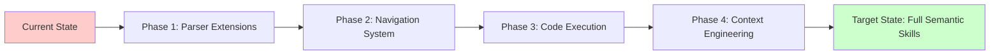
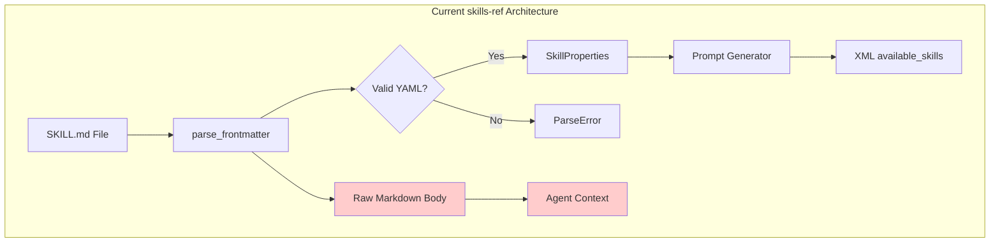
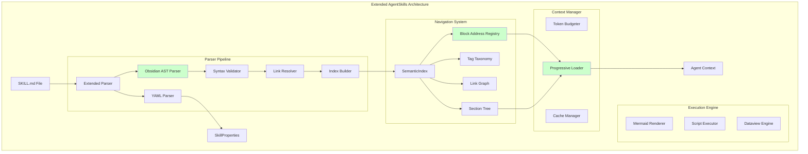
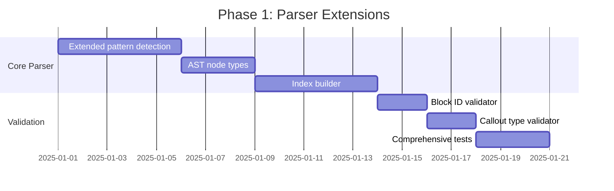

# AGENTS.md — Technical Architecture Dossier

## Obsidian-Flavored Markdown Extensions for AgentSkills Framework

> **Mission**: Enable rich semantic navigation, progressive context loading, and code execution for Obsidian-flavored Markdown within the AgentSkills framework.

---

## §1. Executive Summary

### 1.1 Problem Statement

The AgentSkills framework (`github.com/agentskills/agentskills`) provides a robust foundation for skill-based agent capabilities but exhibits **critical gaps** when processing rich Obsidian-flavored Markdown syntax. The current `skills-ref` parser:

1. **Extracts only YAML frontmatter** — Body content returned as raw string
2. **Ignores all advanced Markdown syntax** — Wikilinks, block IDs, callouts, mermaid untouched
3. **Provides no semantic navigation** — Cannot address specific sections or blocks
4. **Lacks code execution framework** — Mermaid diagrams, scripts require external handling
5. **Missing cross-skill linking** — Skills operate as isolated units

### 1.2 Scope of Analysis

Analysis of the uploaded `reason` skill reveals extensive use of:

| Syntax Category | Elements Used | Framework Support |
|-----------------|---------------|-------------------|
| **Structural Navigation** | `[[#heading]]`, `[[^block-id]]`, `#anchors` | ❌ None |
| **Semantic Links** | `[[wikilinks]]`, `[^n]` citations | ❌ None |
| **Typed Callouts** | `>[!warning]`, `>[!note]`, `>[!caution]` | ❌ None |
| **Executable Code** | ` ```mermaid `, ` ```python ` | ❌ None |
| **Taxonomy Tags** | `#component/parameter`, `#path/typical` | ❌ None |
| **Block References** | `^structure`, `^skip-nothing` | ❌ None |
| **Tables with Logic** | Decision matrices, operation primitives | ⚠️ Partial |
| **Frontmatter** | YAML metadata | ✅ Supported |

### 1.3 Strategic Recommendations



**Priority Matrix**:

| Priority | Component | Impact | Effort | ROI |
|----------|-----------|--------|--------|-----|
| P0 | Block ID Addressing | Critical | Medium | High |
| P0 | Wikilink Resolution | Critical | Medium | High |
| P1 | Callout Type Parsing | High | Low | High |
| P1 | Tag Indexing | High | Low | High |
| P2 | Mermaid Execution | Medium | High | Medium |
| P2 | Progressive Loading | Medium | High | Medium |
| P3 | Cross-Skill Navigation | Medium | High | Medium |

---

## §2. Syntax Support Analysis

### 2.1 Comprehensive Syntax Matrix

#### 2.1.1 Supported by AgentSkills (Current State)

```yaml
supported:
  frontmatter:
    - name: required, validated (1-64 chars, kebab-case)
    - description: required, validated (1-1024 chars)
    - license: optional
    - compatibility: optional
    - metadata: optional key-value mapping
    - allowed-tools: experimental, space-delimited

  markdown_body:
    treatment: "raw_string_passthrough"
    parsing: none
    semantic_extraction: none
```

#### 2.1.2 Unsupported Syntax (Requires Extension)

```typescript
// Type definitions for unsupported Obsidian-flavored Markdown elements

interface WikiLink {
  type: 'wikilink';
  target: string;           // Note name or path
  display?: string;         // Custom display text after |
  heading?: string;         // Section after #
  blockId?: string;         // Block reference after ^
  alias?: string[];         // Alternative names
}

interface BlockReference {
  type: 'block-reference';
  id: string;               // ^identifier
  sourceFile?: string;      // File containing the block
  anchor: 'inline' | 'paragraph' | 'list-item' | 'heading';
}

interface NestedTag {
  type: 'tag';
  path: string[];           // ['component', 'parameter'] for #component/parameter
  isInline: boolean;        // Within text vs standalone
}

interface Callout {
  type: 'callout';
  calloutType: CalloutType; // note, warning, tip, etc.
  title?: string;
  foldState: 'expanded' | 'collapsed' | 'default';
  content: MarkdownNode[];  // Nested content
}

type CalloutType = 
  | 'note' | 'abstract' | 'info' | 'todo' | 'tip' 
  | 'success' | 'question' | 'warning' | 'failure' 
  | 'danger' | 'bug' | 'example' | 'quote';

interface Footnote {
  type: 'footnote';
  id: string;               // [^1] or [^named]
  isInline: boolean;        // ^[inline content] vs [^ref]
  content?: MarkdownNode[]; // Definition content
}

interface MermaidBlock {
  type: 'mermaid';
  diagramType: MermaidDiagramType;
  source: string;           // Raw mermaid code
  nodeClasses?: Map<string, string[]>;  // Styling classes
}

type MermaidDiagramType = 
  | 'graph' | 'flowchart' | 'sequenceDiagram' | 'classDiagram'
  | 'stateDiagram' | 'erDiagram' | 'gantt' | 'pie' | 'gitGraph'
  | 'timeline' | 'mindmap';

interface DataviewQuery {
  type: 'dataview';
  queryType: 'LIST' | 'TABLE' | 'TASK' | 'CALENDAR';
  source: string;
  isInline: boolean;
}

interface TemplaterCommand {
  type: 'templater';
  command: string;          // tp.date.now("YYYY-MM-DD")
  isExecution: boolean;     // <%* vs <%
}
```

### 2.2 Syntax Detection Regex Patterns

```python
# obsidian_patterns.py — Regex patterns for Obsidian-flavored Markdown

import re
from dataclasses import dataclass
from typing import Optional, List, Pattern
from enum import Enum, auto

class PatternType(Enum):
    WIKILINK = auto()
    BLOCK_ID = auto()
    BLOCK_REFERENCE = auto()
    HEADING_LINK = auto()
    NESTED_TAG = auto()
    CALLOUT = auto()
    FOOTNOTE_REF = auto()
    FOOTNOTE_DEF = auto()
    INLINE_FOOTNOTE = auto()
    MERMAID_BLOCK = auto()
    DATAVIEW_BLOCK = auto()
    DATAVIEW_INLINE = auto()
    TEMPLATER_CMD = auto()
    TEMPLATER_EXEC = auto()

@dataclass(frozen=True)
class ObsidianPattern:
    """Immutable pattern definition with validation."""
    pattern_type: PatternType
    regex: Pattern
    description: str
    capture_groups: tuple[str, ...]
    
    def match(self, text: str) -> Optional[re.Match]:
        return self.regex.search(text)
    
    def find_all(self, text: str) -> List[re.Match]:
        return list(self.regex.finditer(text))

# Pattern Definitions
PATTERNS: dict[PatternType, ObsidianPattern] = {
    
    PatternType.WIKILINK: ObsidianPattern(
        pattern_type=PatternType.WIKILINK,
        regex=re.compile(
            r'\[\['
            r'(?P<target>[^\]|#^]+)'           # Note name
            r'(?:#(?P<heading>[^\]|^]+))?'     # Optional heading
            r'(?:\^(?P<block>[^\]|]+))?'       # Optional block ID
            r'(?:\|(?P<display>[^\]]+))?'      # Optional display text
            r'\]\]',
            re.UNICODE
        ),
        description="Wikilink with optional heading, block, and display text",
        capture_groups=('target', 'heading', 'block', 'display')
    ),
    
    PatternType.BLOCK_ID: ObsidianPattern(
        pattern_type=PatternType.BLOCK_ID,
        regex=re.compile(
            r'(?:^|\s)\^(?P<id>[a-zA-Z0-9_-]+)(?:\s|$)',
            re.MULTILINE
        ),
        description="Block identifier at end of line/paragraph",
        capture_groups=('id',)
    ),
    
    PatternType.BLOCK_REFERENCE: ObsidianPattern(
        pattern_type=PatternType.BLOCK_REFERENCE,
        regex=re.compile(
            r'\[\[(?P<file>[^\]#^]+)\^(?P<block>[a-zA-Z0-9_-]+)\]\]'
        ),
        description="Reference to specific block in another file",
        capture_groups=('file', 'block')
    ),
    
    PatternType.NESTED_TAG: ObsidianPattern(
        pattern_type=PatternType.NESTED_TAG,
        regex=re.compile(
            r'(?:^|\s)#(?P<path>(?:[a-zA-Z0-9_-]+/)*[a-zA-Z0-9_-]+)(?:\s|$)',
            re.UNICODE
        ),
        description="Hierarchical tag with slash-separated path",
        capture_groups=('path',)
    ),
    
    PatternType.CALLOUT: ObsidianPattern(
        pattern_type=PatternType.CALLOUT,
        regex=re.compile(
            r'^>\s*\[!(?P<type>\w+)\]'
            r'(?P<fold>[+-])?'
            r'(?:\s+(?P<title>.+))?$',
            re.MULTILINE
        ),
        description="Callout block with type, fold state, and optional title",
        capture_groups=('type', 'fold', 'title')
    ),
    
    PatternType.FOOTNOTE_REF: ObsidianPattern(
        pattern_type=PatternType.FOOTNOTE_REF,
        regex=re.compile(r'\[\^(?P<id>[^\]]+)\](?!\:)'),
        description="Footnote reference in text",
        capture_groups=('id',)
    ),
    
    PatternType.FOOTNOTE_DEF: ObsidianPattern(
        pattern_type=PatternType.FOOTNOTE_DEF,
        regex=re.compile(
            r'^\[\^(?P<id>[^\]]+)\]:\s*(?P<content>.+)$',
            re.MULTILINE
        ),
        description="Footnote definition",
        capture_groups=('id', 'content')
    ),
    
    PatternType.INLINE_FOOTNOTE: ObsidianPattern(
        pattern_type=PatternType.INLINE_FOOTNOTE,
        regex=re.compile(r'\^\[(?P<content>[^\]]+)\]'),
        description="Inline footnote with immediate content",
        capture_groups=('content',)
    ),
    
    PatternType.MERMAID_BLOCK: ObsidianPattern(
        pattern_type=PatternType.MERMAID_BLOCK,
        regex=re.compile(
            r'```mermaid\s*\n(?P<content>.*?)```',
            re.DOTALL
        ),
        description="Mermaid diagram code block",
        capture_groups=('content',)
    ),
    
    PatternType.DATAVIEW_BLOCK: ObsidianPattern(
        pattern_type=PatternType.DATAVIEW_BLOCK,
        regex=re.compile(
            r'```dataview\s*\n(?P<query>.*?)```',
            re.DOTALL
        ),
        description="Dataview query block",
        capture_groups=('query',)
    ),
    
    PatternType.DATAVIEW_INLINE: ObsidianPattern(
        pattern_type=PatternType.DATAVIEW_INLINE,
        regex=re.compile(r'`=\s*(?P<expr>[^`]+)`'),
        description="Inline dataview expression",
        capture_groups=('expr',)
    ),
    
    PatternType.TEMPLATER_CMD: ObsidianPattern(
        pattern_type=PatternType.TEMPLATER_CMD,
        regex=re.compile(r'<%\s*(?P<cmd>[^%*][^%]*)\s*%>'),
        description="Templater output command",
        capture_groups=('cmd',)
    ),
    
    PatternType.TEMPLATER_EXEC: ObsidianPattern(
        pattern_type=PatternType.TEMPLATER_EXEC,
        regex=re.compile(r'<%\*\s*(?P<code>.*?)\s*%>', re.DOTALL),
        description="Templater execution block",
        capture_groups=('code',)
    ),
}

def extract_all_syntax(text: str) -> dict[PatternType, List[dict]]:
    """Extract all Obsidian syntax elements from text."""
    results = {}
    for ptype, pattern in PATTERNS.items():
        matches = pattern.find_all(text)
        results[ptype] = [
            {name: m.group(name) for name in pattern.capture_groups}
            for m in matches
        ]
    return results
```

---

## §3. Architectural Gap Analysis

### 3.1 Current AgentSkills Architecture



**Gap Identification**:

| Gap ID | Component | Current Behavior | Required Behavior |
|--------|-----------|------------------|-------------------|
| G-001 | Body Parser | Raw string passthrough | Semantic AST extraction |
| G-002 | Block Addressing | None | `skill:block_id` resolution |
| G-003 | Link Resolution | None | Wikilink → target resolution |
| G-004 | Tag Indexing | None | Hierarchical tag search |
| G-005 | Callout Extraction | None | Typed callout parsing |
| G-006 | Code Execution | None | Mermaid/script execution |
| G-007 | Cross-Skill Refs | None | `[[other-skill#section]]` |
| G-008 | Progressive Load | All or nothing | Section-level loading |
| G-009 | Validation | Frontmatter only | Full syntax validation |
| G-010 | Context Budget | No awareness | Token-aware loading |

### 3.2 Proposed Extended Architecture



---

## §4. Type System Specification

### 4.1 Core Type Definitions

```typescript
// types/core.ts — Core type system for extended AgentSkills

/**
 * Represents the complete parsed structure of a SKILL.md file
 */
interface ParsedSkill {
  readonly properties: SkillProperties;
  readonly ast: SkillAST;
  readonly index: SemanticIndex;
  readonly validation: ValidationResult;
}

/**
 * Abstract Syntax Tree for skill body content
 */
interface SkillAST {
  readonly nodes: readonly ASTNode[];
  readonly metadata: ASTMetadata;
}

interface ASTMetadata {
  readonly nodeCount: number;
  readonly estimatedTokens: number;
  readonly maxDepth: number;
  readonly hasExecutableCode: boolean;
}

/**
 * Union type for all possible AST nodes
 */
type ASTNode =
  | HeadingNode
  | ParagraphNode
  | ListNode
  | TableNode
  | CodeBlockNode
  | CalloutNode
  | BlockquoteNode
  | WikiLinkNode
  | FootnoteNode
  | TagNode
  | HorizontalRuleNode
  | FrontmatterNode;

/**
 * Base interface for all AST nodes
 */
interface BaseASTNode {
  readonly type: string;
  readonly position: SourcePosition;
  readonly blockId?: string;         // ^id if present
  readonly raw: string;              // Original source text
}

interface SourcePosition {
  readonly start: LineColumn;
  readonly end: LineColumn;
}

interface LineColumn {
  readonly line: number;    // 1-indexed
  readonly column: number;  // 0-indexed
  readonly offset: number;  // byte offset from start
}

/**
 * Heading node with anchor and nesting support
 */
interface HeadingNode extends BaseASTNode {
  readonly type: 'heading';
  readonly level: 1 | 2 | 3 | 4 | 5 | 6;
  readonly text: string;
  readonly anchor: string;           // Auto-generated slug
  readonly children: readonly ASTNode[];  // Content under this heading
}

/**
 * Code block with language detection and execution metadata
 */
interface CodeBlockNode extends BaseASTNode {
  readonly type: 'codeblock';
  readonly language: string | null;
  readonly content: string;
  readonly isExecutable: boolean;
  readonly executionType?: 'mermaid' | 'dataview' | 'templater' | 'script';
  readonly meta?: Record<string, string>;  // Additional attributes
}

/**
 * Callout with typed semantics
 */
interface CalloutNode extends BaseASTNode {
  readonly type: 'callout';
  readonly calloutType: CalloutType;
  readonly title?: string;
  readonly foldState: 'expanded' | 'collapsed' | 'default';
  readonly children: readonly ASTNode[];
}

/**
 * Table with structured data extraction
 */
interface TableNode extends BaseASTNode {
  readonly type: 'table';
  readonly headers: readonly TableCell[];
  readonly rows: readonly TableRow[];
  readonly alignments: readonly ('left' | 'center' | 'right')[];
}

interface TableRow {
  readonly cells: readonly TableCell[];
}

interface TableCell {
  readonly content: readonly InlineNode[];
  readonly raw: string;
}

/**
 * Inline content types
 */
type InlineNode =
  | TextNode
  | EmphasisNode
  | StrongNode
  | CodeInlineNode
  | WikiLinkInline
  | ExternalLinkNode
  | FootnoteRefNode
  | TagInlineNode
  | HighlightNode;

interface WikiLinkInline {
  readonly type: 'wikilink';
  readonly target: string;
  readonly display?: string;
  readonly heading?: string;
  readonly blockId?: string;
  readonly resolved?: ResolvedLink;
}

interface ResolvedLink {
  readonly exists: boolean;
  readonly absolutePath?: string;
  readonly skillName?: string;
  readonly nodePosition?: SourcePosition;
}
```

### 4.2 Index Types

```typescript
// types/index.ts — Semantic index types

/**
 * Complete semantic index for a skill
 */
interface SemanticIndex {
  readonly blockRegistry: BlockRegistry;
  readonly headingTree: HeadingTree;
  readonly tagTaxonomy: TagTaxonomy;
  readonly linkGraph: LinkGraph;
  readonly footnoteMap: FootnoteMap;
  readonly calloutsByType: CalloutIndex;
  readonly executableBlocks: ExecutableIndex;
}

/**
 * Block ID → Node mapping with O(1) lookup
 */
interface BlockRegistry {
  readonly blocks: ReadonlyMap<string, BlockEntry>;
  lookup(blockId: string): BlockEntry | undefined;
  exists(blockId: string): boolean;
}

interface BlockEntry {
  readonly id: string;
  readonly node: ASTNode;
  readonly context: BlockContext;
}

interface BlockContext {
  readonly parentHeading?: string;
  readonly sectionPath: readonly string[];  // ["reduce", "five primitive operations"]
  readonly depth: number;
}

/**
 * Hierarchical heading structure
 */
interface HeadingTree {
  readonly root: HeadingTreeNode;
  findByAnchor(anchor: string): HeadingTreeNode | undefined;
  findByPath(path: readonly string[]): HeadingTreeNode | undefined;
  getPathTo(node: HeadingTreeNode): readonly string[];
}

interface HeadingTreeNode {
  readonly heading: HeadingNode;
  readonly children: readonly HeadingTreeNode[];
  readonly parent?: HeadingTreeNode;
}

/**
 * Tag taxonomy with hierarchical structure
 */
interface TagTaxonomy {
  readonly tags: ReadonlyMap<string, TagEntry[]>;  // Full path → entries
  readonly tree: TagTreeNode;
  findByPrefix(prefix: string): readonly TagEntry[];
  findExact(path: string): readonly TagEntry[];
}

interface TagEntry {
  readonly fullPath: string;      // "component/parameter"
  readonly segments: string[];    // ["component", "parameter"]
  readonly position: SourcePosition;
  readonly context: string;       // Surrounding text
}

interface TagTreeNode {
  readonly segment: string;
  readonly children: ReadonlyMap<string, TagTreeNode>;
  readonly entries: readonly TagEntry[];
}

/**
 * Link graph for navigation and validation
 */
interface LinkGraph {
  readonly outbound: ReadonlyMap<string, LinkInfo[]>;  // source → targets
  readonly inbound: ReadonlyMap<string, LinkInfo[]>;   // target → sources
  readonly unresolved: readonly LinkInfo[];
}

interface LinkInfo {
  readonly source: string;        // Current skill or block
  readonly target: string;        // Target skill, heading, or block
  readonly linkType: 'wikilink' | 'external' | 'footnote';
  readonly position: SourcePosition;
  readonly resolved: boolean;
}
```

### 4.3 Validation Types

```typescript
// types/validation.ts — Validation result types

/**
 * Comprehensive validation result
 */
interface ValidationResult {
  readonly valid: boolean;
  readonly errors: readonly ValidationError[];
  readonly warnings: readonly ValidationWarning[];
  readonly info: readonly ValidationInfo[];
  readonly metrics: ValidationMetrics;
}

interface ValidationError {
  readonly code: ErrorCode;
  readonly message: string;
  readonly position: SourcePosition;
  readonly severity: 'error';
  readonly suggestion?: string;
}

interface ValidationWarning {
  readonly code: WarningCode;
  readonly message: string;
  readonly position: SourcePosition;
  readonly severity: 'warning';
  readonly suggestion?: string;
}

interface ValidationInfo {
  readonly code: InfoCode;
  readonly message: string;
  readonly position?: SourcePosition;
  readonly severity: 'info';
}

type ErrorCode =
  | 'E001_INVALID_FRONTMATTER'
  | 'E002_MISSING_REQUIRED_FIELD'
  | 'E003_INVALID_NAME_FORMAT'
  | 'E004_UNCLOSED_CODE_BLOCK'
  | 'E005_INVALID_CALLOUT_TYPE'
  | 'E006_DUPLICATE_BLOCK_ID'
  | 'E007_MALFORMED_WIKILINK'
  | 'E008_ORPHANED_FOOTNOTE_REF'
  | 'E009_INVALID_TABLE_STRUCTURE'
  | 'E010_MERMAID_SYNTAX_ERROR';

type WarningCode =
  | 'W001_UNRESOLVED_WIKILINK'
  | 'W002_UNUSED_BLOCK_ID'
  | 'W003_DEEP_NESTING'
  | 'W004_LARGE_CODE_BLOCK'
  | 'W005_MISSING_LANGUAGE_TAG'
  | 'W006_INCONSISTENT_TAG_PATH'
  | 'W007_LONG_HEADING'
  | 'W008_DUPLICATE_HEADING_ANCHOR';

interface ValidationMetrics {
  readonly totalNodes: number;
  readonly errorCount: number;
  readonly warningCount: number;
  readonly estimatedTokens: number;
  readonly blockIdCount: number;
  readonly unresolvedLinkCount: number;
  readonly executableBlockCount: number;
}
```

---

## §5. Parser Extension Architecture

### 5.1 Extended Parser Implementation

```python
# parser/extended_parser.py — Extended parser for Obsidian-flavored Markdown

from __future__ import annotations
from dataclasses import dataclass, field
from typing import Optional, List, Dict, Iterator, Tuple
from enum import Enum, auto
import re
from pathlib import Path

from .ast_types import (
    ASTNode, HeadingNode, ParagraphNode, CodeBlockNode, 
    CalloutNode, TableNode, WikiLinkInline, SourcePosition
)
from .patterns import PATTERNS, PatternType
from .index_builder import SemanticIndexBuilder


class ParserState(Enum):
    """Parser state machine states."""
    NORMAL = auto()
    IN_CODE_BLOCK = auto()
    IN_FRONTMATTER = auto()
    IN_CALLOUT = auto()
    IN_TABLE = auto()
    IN_LIST = auto()


@dataclass
class ParserContext:
    """Mutable context during parsing."""
    state: ParserState = ParserState.NORMAL
    current_code_fence: Optional[str] = None
    code_language: Optional[str] = None
    code_buffer: List[str] = field(default_factory=list)
    callout_buffer: List[str] = field(default_factory=list)
    callout_type: Optional[str] = None
    callout_title: Optional[str] = None
    callout_fold: Optional[str] = None
    table_buffer: List[str] = field(default_factory=list)
    current_heading_stack: List[HeadingNode] = field(default_factory=list)
    line_number: int = 0
    column: int = 0


@dataclass
class ExtendedParseResult:
    """Complete result from extended parsing."""
    properties: 'SkillProperties'
    ast: List[ASTNode]
    index: 'SemanticIndex'
    validation: 'ValidationResult'
    raw_body: str


class ExtendedSkillParser:
    """
    Extended parser for SKILL.md files supporting Obsidian-flavored Markdown.
    
    Design principles:
    1. Single-pass parsing with state machine
    2. Immediate index building during parse
    3. Lazy validation (deferred until complete)
    4. Position tracking for all nodes
    """
    
    def __init__(self, skill_directory: Path):
        self.skill_dir = skill_directory
        self.skill_md_path = self._find_skill_md()
        self.index_builder = SemanticIndexBuilder()
        
    def _find_skill_md(self) -> Path:
        """Locate SKILL.md (case-insensitive)."""
        for name in ['SKILL.md', 'skill.md']:
            path = self.skill_dir / name
            if path.exists():
                return path
        raise ParseError(f"No SKILL.md found in {self.skill_dir}")
    
    def parse(self) -> ExtendedParseResult:
        """Execute complete parse with AST, index, and validation."""
        content = self.skill_md_path.read_text(encoding='utf-8')
        
        # Phase 1: Extract frontmatter
        properties, body, body_start_line = self._parse_frontmatter(content)
        
        # Phase 2: Parse body into AST
        ast = self._parse_body(body, body_start_line)
        
        # Phase 3: Build semantic index
        index = self.index_builder.build(ast)
        
        # Phase 4: Validate
        validation = self._validate(properties, ast, index)
        
        return ExtendedParseResult(
            properties=properties,
            ast=ast,
            index=index,
            validation=validation,
            raw_body=body
        )
    
    def _parse_frontmatter(self, content: str) -> Tuple['SkillProperties', str, int]:
        """Extract and parse YAML frontmatter."""
        if not content.startswith('---'):
            raise ParseError("SKILL.md must start with YAML frontmatter (---)")
        
        parts = content.split('---', 2)
        if len(parts) < 3:
            raise ParseError("Frontmatter not properly closed with ---")
        
        yaml_content = parts[1].strip()
        body = parts[2].lstrip('\n')
        
        # Count lines in frontmatter to get body start line
        frontmatter_lines = parts[0].count('\n') + parts[1].count('\n') + 2
        
        properties = self._parse_yaml(yaml_content)
        return properties, body, frontmatter_lines + 1
    
    def _parse_body(self, body: str, start_line: int) -> List[ASTNode]:
        """Parse markdown body into AST with full Obsidian syntax support."""
        lines = body.split('\n')
        ctx = ParserContext(line_number=start_line)
        nodes: List[ASTNode] = []
        
        for line in lines:
            ctx.line_number += 1
            node = self._process_line(line, ctx)
            if node:
                nodes.append(node)
                self.index_builder.index_node(node)
        
        # Flush any pending buffers
        pending = self._flush_buffers(ctx)
        nodes.extend(pending)
        
        return nodes
    
    def _process_line(self, line: str, ctx: ParserContext) -> Optional[ASTNode]:
        """Process single line based on current parser state."""
        
        # State: Inside code block
        if ctx.state == ParserState.IN_CODE_BLOCK:
            return self._process_code_block_line(line, ctx)
        
        # State: Inside callout
        if ctx.state == ParserState.IN_CALLOUT:
            return self._process_callout_line(line, ctx)
        
        # State: Inside table
        if ctx.state == ParserState.IN_TABLE:
            return self._process_table_line(line, ctx)
        
        # State: Normal - detect new constructs
        return self._process_normal_line(line, ctx)
    
    def _process_normal_line(self, line: str, ctx: ParserContext) -> Optional[ASTNode]:
        """Process line in normal state, detecting construct starts."""
        
        # Check for code fence start
        code_match = re.match(r'^(`{3,}|~{3,})(\w*)?(.*)$', line)
        if code_match:
            ctx.state = ParserState.IN_CODE_BLOCK
            ctx.current_code_fence = code_match.group(1)
            ctx.code_language = code_match.group(2) or None
            ctx.code_buffer = []
            return None
        
        # Check for callout start
        callout_match = PATTERNS[PatternType.CALLOUT].regex.match(line)
        if callout_match:
            ctx.state = ParserState.IN_CALLOUT
            ctx.callout_type = callout_match.group('type').lower()
            ctx.callout_title = callout_match.group('title')
            ctx.callout_fold = callout_match.group('fold')
            ctx.callout_buffer = []
            return None
        
        # Check for table start
        if '|' in line and re.match(r'^\s*\|', line):
            ctx.state = ParserState.IN_TABLE
            ctx.table_buffer = [line]
            return None
        
        # Check for heading
        heading_match = re.match(r'^(#{1,6})\s+(.+)$', line)
        if heading_match:
            return self._create_heading_node(
                level=len(heading_match.group(1)),
                text=heading_match.group(2),
                line=ctx.line_number
            )
        
        # Check for block ID at end of line
        block_id = None
        block_match = PATTERNS[PatternType.BLOCK_ID].regex.search(line)
        if block_match:
            block_id = block_match.group('id')
            line = line[:block_match.start()].rstrip()
        
        # Regular paragraph
        if line.strip():
            return self._create_paragraph_node(line, ctx.line_number, block_id)
        
        return None
    
    def _process_code_block_line(self, line: str, ctx: ParserContext) -> Optional[ASTNode]:
        """Process line inside code block."""
        if line.startswith(ctx.current_code_fence):
            # End of code block
            ctx.state = ParserState.NORMAL
            return self._create_code_block_node(
                language=ctx.code_language,
                content='\n'.join(ctx.code_buffer),
                line=ctx.line_number - len(ctx.code_buffer) - 1
            )
        else:
            ctx.code_buffer.append(line)
            return None
    
    def _create_heading_node(self, level: int, text: str, line: int) -> HeadingNode:
        """Create heading node with anchor generation."""
        # Extract block ID if present
        block_id = None
        block_match = PATTERNS[PatternType.BLOCK_ID].regex.search(text)
        if block_match:
            block_id = block_match.group('id')
            text = text[:block_match.start()].rstrip()
        
        # Generate anchor slug
        anchor = self._generate_anchor(text)
        
        # Parse inline content for wikilinks, tags, etc.
        inline_nodes = self._parse_inline(text)
        
        return HeadingNode(
            type='heading',
            level=level,
            text=text,
            anchor=anchor,
            block_id=block_id,
            position=SourcePosition(
                start={'line': line, 'column': 0, 'offset': 0},
                end={'line': line, 'column': len(text), 'offset': 0}
            ),
            inline_content=inline_nodes,
            children=[]
        )
    
    def _generate_anchor(self, text: str) -> str:
        """Generate URL-safe anchor from heading text."""
        # Remove inline formatting
        cleaned = re.sub(r'\*\*|\*|`|~~|==', '', text)
        # Remove wikilinks, keeping display text
        cleaned = re.sub(r'\[\[([^\]|]+\|)?([^\]]+)\]\]', r'\2', cleaned)
        # Convert to lowercase, replace spaces with hyphens
        anchor = cleaned.lower().strip()
        anchor = re.sub(r'\s+', '-', anchor)
        # Remove non-alphanumeric except hyphens
        anchor = re.sub(r'[^a-z0-9-]', '', anchor)
        # Collapse multiple hyphens
        anchor = re.sub(r'-+', '-', anchor)
        return anchor.strip('-')
    
    def _parse_inline(self, text: str) -> List['InlineNode']:
        """Parse inline content for wikilinks, tags, footnotes, etc."""
        nodes = []
        
        # Extract wikilinks
        for match in PATTERNS[PatternType.WIKILINK].find_all(text):
            nodes.append({
                'type': 'wikilink',
                'target': match.group('target'),
                'display': match.group('display'),
                'heading': match.group('heading'),
                'block_id': match.group('block'),
                'position': {'start': match.start(), 'end': match.end()}
            })
        
        # Extract tags
        for match in PATTERNS[PatternType.NESTED_TAG].find_all(text):
            nodes.append({
                'type': 'tag',
                'path': match.group('path').split('/'),
                'position': {'start': match.start(), 'end': match.end()}
            })
        
        # Extract footnote references
        for match in PATTERNS[PatternType.FOOTNOTE_REF].find_all(text):
            nodes.append({
                'type': 'footnote_ref',
                'id': match.group('id'),
                'position': {'start': match.start(), 'end': match.end()}
            })
        
        return nodes
    
    def _create_code_block_node(
        self, 
        language: Optional[str], 
        content: str, 
        line: int
    ) -> CodeBlockNode:
        """Create code block node with execution metadata."""
        is_executable = language in ('mermaid', 'dataview', 'python', 'bash', 'javascript')
        execution_type = None
        
        if language == 'mermaid':
            execution_type = 'mermaid'
        elif language == 'dataview':
            execution_type = 'dataview'
        elif language in ('python', 'bash', 'javascript'):
            execution_type = 'script'
        
        return CodeBlockNode(
            type='codeblock',
            language=language,
            content=content,
            is_executable=is_executable,
            execution_type=execution_type,
            position=SourcePosition(
                start={'line': line, 'column': 0, 'offset': 0},
                end={'line': line + content.count('\n') + 2, 'column': 0, 'offset': 0}
            ),
            raw=f"```{language or ''}\n{content}\n```"
        )


class ParseError(Exception):
    """Raised when parsing fails."""
    
    def __init__(self, message: str, position: Optional[SourcePosition] = None):
        super().__init__(message)
        self.position = position
```

### 5.2 Index Builder Implementation

```python
# parser/index_builder.py — Semantic index construction

from dataclasses import dataclass, field
from typing import Dict, List, Set, Optional
from collections import defaultdict

from .ast_types import ASTNode, HeadingNode, WikiLinkInline


@dataclass
class BlockEntry:
    """Registry entry for a block ID."""
    id: str
    node: ASTNode
    section_path: List[str]
    depth: int


@dataclass 
class HeadingTreeNode:
    """Tree node for heading hierarchy."""
    heading: HeadingNode
    children: List['HeadingTreeNode'] = field(default_factory=list)
    parent: Optional['HeadingTreeNode'] = None


@dataclass
class TagEntry:
    """Registry entry for a tag occurrence."""
    full_path: str
    segments: List[str]
    position: dict
    context: str


class SemanticIndexBuilder:
    """
    Builds semantic index during AST traversal.
    
    Indexes:
    - Block IDs → nodes (O(1) lookup)
    - Heading tree (hierarchical navigation)
    - Tag taxonomy (prefix search)
    - Link graph (outbound/inbound)
    - Footnotes (ref → def mapping)
    """
    
    def __init__(self):
        self.block_registry: Dict[str, BlockEntry] = {}
        self.heading_tree: Optional[HeadingTreeNode] = None
        self.heading_stack: List[HeadingTreeNode] = []
        self.tag_entries: List[TagEntry] = []
        self.tag_tree: Dict[str, Dict] = {}
        self.outbound_links: Dict[str, List[dict]] = defaultdict(list)
        self.inbound_links: Dict[str, List[dict]] = defaultdict(list)
        self.unresolved_links: List[dict] = []
        self.footnote_refs: Dict[str, List[dict]] = defaultdict(list)
        self.footnote_defs: Dict[str, dict] = {}
        self.current_section_path: List[str] = []
        
    def index_node(self, node: ASTNode) -> None:
        """Index a single AST node."""
        
        # Index block ID if present
        if hasattr(node, 'block_id') and node.block_id:
            self._index_block(node)
        
        # Index by node type
        if node.type == 'heading':
            self._index_heading(node)
        elif node.type == 'wikilink':
            self._index_wikilink(node)
        elif node.type == 'tag':
            self._index_tag(node)
        elif node.type == 'footnote_ref':
            self._index_footnote_ref(node)
        elif node.type == 'footnote_def':
            self._index_footnote_def(node)
        
        # Recursively index inline content
        if hasattr(node, 'inline_content'):
            for inline in node.inline_content:
                self.index_node(inline)
        
        # Recursively index children
        if hasattr(node, 'children'):
            for child in node.children:
                self.index_node(child)
    
    def _index_block(self, node: ASTNode) -> None:
        """Register a block ID."""
        block_id = node.block_id
        
        if block_id in self.block_registry:
            raise ValidationError(
                code='E006_DUPLICATE_BLOCK_ID',
                message=f"Duplicate block ID: ^{block_id}",
                position=node.position
            )
        
        self.block_registry[block_id] = BlockEntry(
            id=block_id,
            node=node,
            section_path=list(self.current_section_path),
            depth=len(self.current_section_path)
        )
    
    def _index_heading(self, node: HeadingNode) -> None:
        """Add heading to hierarchical tree."""
        tree_node = HeadingTreeNode(heading=node)
        
        # Pop stack until we find parent level
        while (self.heading_stack and 
               self.heading_stack[-1].heading.level >= node.level):
            self.heading_stack.pop()
            if self.current_section_path:
                self.current_section_path.pop()
        
        # Set parent relationship
        if self.heading_stack:
            parent = self.heading_stack[-1]
            tree_node.parent = parent
            parent.children.append(tree_node)
        else:
            # Root level heading
            if self.heading_tree is None:
                self.heading_tree = tree_node
        
        self.heading_stack.append(tree_node)
        self.current_section_path.append(node.anchor)
    
    def _index_tag(self, tag_data: dict) -> None:
        """Index hierarchical tag."""
        path = tag_data.get('path', [])
        full_path = '/'.join(path)
        
        entry = TagEntry(
            full_path=full_path,
            segments=path,
            position=tag_data.get('position', {}),
            context=""  # TODO: Extract surrounding text
        )
        self.tag_entries.append(entry)
        
        # Build tag tree
        current = self.tag_tree
        for segment in path:
            if segment not in current:
                current[segment] = {'_entries': [], '_children': {}}
            current[segment]['_entries'].append(entry)
            current = current[segment]['_children']
    
    def _index_wikilink(self, link_data: dict) -> None:
        """Index wikilink for graph construction."""
        target = link_data.get('target', '')
        source = '/'.join(self.current_section_path) if self.current_section_path else 'root'
        
        link_info = {
            'source': source,
            'target': target,
            'heading': link_data.get('heading'),
            'block_id': link_data.get('block_id'),
            'position': link_data.get('position'),
            'resolved': False  # Will be resolved in later pass
        }
        
        self.outbound_links[source].append(link_info)
        self.inbound_links[target].append(link_info)
    
    def build(self, ast: List[ASTNode]) -> 'SemanticIndex':
        """Build complete index from AST."""
        # Index all nodes
        for node in ast:
            self.index_node(node)
        
        # Resolve links
        self._resolve_links()
        
        # Build final index object
        return SemanticIndex(
            block_registry=self.block_registry,
            heading_tree=self.heading_tree,
            tag_entries=self.tag_entries,
            tag_tree=self.tag_tree,
            outbound_links=dict(self.outbound_links),
            inbound_links=dict(self.inbound_links),
            unresolved_links=self.unresolved_links,
            footnote_refs=dict(self.footnote_refs),
            footnote_defs=self.footnote_defs
        )
    
    def _resolve_links(self) -> None:
        """Resolve wikilinks to targets."""
        for source, links in self.outbound_links.items():
            for link in links:
                target = link['target']
                
                # Check if target is a block ID reference
                if link.get('block_id'):
                    if link['block_id'] in self.block_registry:
                        link['resolved'] = True
                    else:
                        self.unresolved_links.append(link)
                
                # Check if target is a heading reference
                elif link.get('heading'):
                    # TODO: Implement heading resolution
                    pass
                
                # Check if target is another skill
                else:
                    # TODO: Implement cross-skill resolution
                    self.unresolved_links.append(link)


@dataclass
class SemanticIndex:
    """Complete semantic index for a skill."""
    block_registry: Dict[str, BlockEntry]
    heading_tree: Optional[HeadingTreeNode]
    tag_entries: List[TagEntry]
    tag_tree: Dict
    outbound_links: Dict[str, List[dict]]
    inbound_links: Dict[str, List[dict]]
    unresolved_links: List[dict]
    footnote_refs: Dict[str, List[dict]]
    footnote_defs: Dict[str, dict]
    
    def lookup_block(self, block_id: str) -> Optional[BlockEntry]:
        """O(1) block lookup."""
        return self.block_registry.get(block_id)
    
    def find_heading_by_anchor(self, anchor: str) -> Optional[HeadingTreeNode]:
        """Find heading node by anchor slug."""
        def search(node: Optional[HeadingTreeNode]) -> Optional[HeadingTreeNode]:
            if node is None:
                return None
            if node.heading.anchor == anchor:
                return node
            for child in node.children:
                result = search(child)
                if result:
                    return result
            return None
        return search(self.heading_tree)
    
    def find_tags_by_prefix(self, prefix: str) -> List[TagEntry]:
        """Find all tags matching prefix."""
        segments = prefix.split('/')
        current = self.tag_tree
        
        for segment in segments:
            if segment in current:
                current = current[segment]['_children']
            else:
                return []
        
        # Collect all entries under this prefix
        def collect_entries(tree_node: Dict) -> List[TagEntry]:
            entries = []
            for key, value in tree_node.items():
                if key == '_entries':
                    entries.extend(value)
                elif key == '_children':
                    entries.extend(collect_entries(value))
                else:
                    entries.extend(value.get('_entries', []))
                    entries.extend(collect_entries(value.get('_children', {})))
            return entries
        
        return collect_entries(current)
```

---

## §6. Navigation System Design

### 6.1 Block-Level Addressing

```python
# navigation/block_navigator.py — Block-level content addressing

from dataclasses import dataclass
from typing import Optional, List, Union
from pathlib import Path

from ..parser.index_builder import SemanticIndex, BlockEntry


@dataclass
class NavigationResult:
    """Result of a navigation request."""
    found: bool
    content: Optional[str] = None
    node: Optional['ASTNode'] = None
    context: Optional['NavigationContext'] = None
    error: Optional[str] = None


@dataclass
class NavigationContext:
    """Context around navigated content."""
    skill_name: str
    section_path: List[str]
    parent_heading: Optional[str]
    siblings: List[str]
    depth: int


class BlockNavigator:
    """
    Navigate to specific blocks, headings, or sections within skills.
    
    Addressing schemes:
    - `skill:^block-id`      → Specific block by ID
    - `skill:#heading`       → Heading by anchor
    - `skill:#heading/sub`   → Nested heading path
    - `skill:*`              → Entire skill body
    """
    
    def __init__(self, skill_registry: 'SkillRegistry'):
        self.registry = skill_registry
    
    def navigate(self, address: str) -> NavigationResult:
        """
        Navigate to content by address.
        
        Address formats:
        - "reason:^structure"          → Block ^structure in reason skill
        - "reason:#parse"              → #parse heading in reason skill
        - "reason:#reduce/five-primitive-operations"  → Nested heading
        - "reason:*"                   → Full skill body
        """
        try:
            skill_name, target = self._parse_address(address)
        except ValueError as e:
            return NavigationResult(found=False, error=str(e))
        
        # Get skill index
        skill_index = self.registry.get_index(skill_name)
        if skill_index is None:
            return NavigationResult(
                found=False, 
                error=f"Skill not found: {skill_name}"
            )
        
        # Navigate based on target type
        if target == '*':
            return self._navigate_full_skill(skill_name)
        elif target.startswith('^'):
            return self._navigate_to_block(skill_index, target[1:], skill_name)
        elif target.startswith('#'):
            return self._navigate_to_heading(skill_index, target[1:], skill_name)
        else:
            return NavigationResult(
                found=False,
                error=f"Invalid target format: {target}"
            )
    
    def _parse_address(self, address: str) -> tuple[str, str]:
        """Parse address into skill name and target."""
        if ':' not in address:
            raise ValueError(f"Invalid address format (missing ':'): {address}")
        
        parts = address.split(':', 1)
        skill_name = parts[0].strip()
        target = parts[1].strip()
        
        if not skill_name:
            raise ValueError("Empty skill name in address")
        if not target:
            raise ValueError("Empty target in address")
        
        return skill_name, target
    
    def _navigate_to_block(
        self, 
        index: SemanticIndex, 
        block_id: str,
        skill_name: str
    ) -> NavigationResult:
        """Navigate to specific block by ID."""
        entry = index.lookup_block(block_id)
        
        if entry is None:
            return NavigationResult(
                found=False,
                error=f"Block not found: ^{block_id}"
            )
        
        return NavigationResult(
            found=True,
            content=entry.node.raw if hasattr(entry.node, 'raw') else None,
            node=entry.node,
            context=NavigationContext(
                skill_name=skill_name,
                section_path=entry.section_path,
                parent_heading=entry.section_path[-1] if entry.section_path else None,
                siblings=self._get_sibling_blocks(index, entry),
                depth=entry.depth
            )
        )
    
    def _navigate_to_heading(
        self,
        index: SemanticIndex,
        heading_path: str,
        skill_name: str
    ) -> NavigationResult:
        """Navigate to heading by anchor path."""
        # Support nested paths: "reduce/five-primitive-operations"
        path_segments = heading_path.split('/')
        
        current_node = index.heading_tree
        for segment in path_segments:
            if current_node is None:
                return NavigationResult(
                    found=False,
                    error=f"Heading path not found: #{heading_path}"
                )
            
            # Search children for matching anchor
            found = False
            for child in (current_node.children if hasattr(current_node, 'children') else []):
                if child.heading.anchor == segment:
                    current_node = child
                    found = True
                    break
            
            if not found:
                # Also check current node
                if hasattr(current_node, 'heading') and current_node.heading.anchor == segment:
                    found = True
                else:
                    return NavigationResult(
                        found=False,
                        error=f"Heading segment not found: {segment}"
                    )
        
        if current_node is None or not hasattr(current_node, 'heading'):
            return NavigationResult(found=False, error="Invalid heading path")
        
        return NavigationResult(
            found=True,
            content=self._extract_section_content(current_node),
            node=current_node.heading,
            context=NavigationContext(
                skill_name=skill_name,
                section_path=path_segments,
                parent_heading=path_segments[-1] if path_segments else None,
                siblings=self._get_sibling_headings(current_node),
                depth=len(path_segments)
            )
        )
    
    def _extract_section_content(self, heading_node: 'HeadingTreeNode') -> str:
        """Extract all content under a heading."""
        # Include heading and all children
        parts = [heading_node.heading.raw]
        
        def collect_children(node):
            content = []
            for child in node.children:
                if hasattr(child, 'raw'):
                    content.append(child.raw)
                if hasattr(child, 'children'):
                    content.extend(collect_children(child))
            return content
        
        parts.extend(collect_children(heading_node))
        return '\n\n'.join(parts)
    
    def _get_sibling_blocks(
        self, 
        index: SemanticIndex, 
        entry: BlockEntry
    ) -> List[str]:
        """Get sibling block IDs at same depth."""
        siblings = []
        for block_id, block_entry in index.block_registry.items():
            if (block_entry.section_path == entry.section_path and 
                block_id != entry.id):
                siblings.append(block_id)
        return siblings
    
    def _get_sibling_headings(self, node: 'HeadingTreeNode') -> List[str]:
        """Get sibling heading anchors."""
        if node.parent is None:
            return []
        return [
            child.heading.anchor 
            for child in node.parent.children 
            if child.heading.anchor != node.heading.anchor
        ]


class SkillRegistry:
    """Registry of parsed skills with their indexes."""
    
    def __init__(self):
        self._skills: Dict[str, 'ExtendedParseResult'] = {}
    
    def register(self, skill_name: str, parse_result: 'ExtendedParseResult') -> None:
        """Register a parsed skill."""
        self._skills[skill_name] = parse_result
    
    def get_index(self, skill_name: str) -> Optional[SemanticIndex]:
        """Get semantic index for a skill."""
        result = self._skills.get(skill_name)
        return result.index if result else None
    
    def list_skills(self) -> List[str]:
        """List all registered skill names."""
        return list(self._skills.keys())
```

### 6.2 Progressive Content Loading

```python
# navigation/progressive_loader.py — Token-aware progressive loading

from dataclasses import dataclass, field
from typing import List, Optional, Iterator, Callable
from enum import Enum, auto
import tiktoken


class LoadingStrategy(Enum):
    """Strategies for progressive content loading."""
    FULL = auto()           # Load entire skill
    HEADING_ONLY = auto()   # Load headings + descriptions
    SECTION = auto()        # Load specific section
    BLOCK = auto()          # Load specific block
    SUMMARY = auto()        # Load summary/overview only


@dataclass
class LoadRequest:
    """Request for content loading."""
    skill_name: str
    strategy: LoadingStrategy
    target: Optional[str] = None        # Heading anchor or block ID
    max_tokens: Optional[int] = None    # Token budget
    include_context: bool = True        # Include surrounding context
    depth: int = 1                       # For HEADING_ONLY: how deep to show


@dataclass
class LoadedContent:
    """Result of progressive loading."""
    content: str
    token_count: int
    truncated: bool
    sections_loaded: List[str]
    sections_available: List[str]
    continuation_hint: Optional[str] = None


class ProgressiveLoader:
    """
    Load skill content progressively based on token budget.
    
    Strategies:
    1. HEADING_ONLY: Just section headers + first paragraph
    2. SECTION: Single section fully loaded
    3. BLOCK: Single block with minimal context
    4. SUMMARY: Overview/abstract only
    5. FULL: Everything (use sparingly)
    """
    
    def __init__(self, registry: 'SkillRegistry', tokenizer: str = 'cl100k_base'):
        self.registry = registry
        self.encoder = tiktoken.get_encoding(tokenizer)
        
    def load(self, request: LoadRequest) -> LoadedContent:
        """Load content based on request."""
        
        parse_result = self.registry._skills.get(request.skill_name)
        if parse_result is None:
            return LoadedContent(
                content=f"Skill not found: {request.skill_name}",
                token_count=0,
                truncated=False,
                sections_loaded=[],
                sections_available=[]
            )
        
        if request.strategy == LoadingStrategy.FULL:
            return self._load_full(parse_result, request.max_tokens)
        elif request.strategy == LoadingStrategy.HEADING_ONLY:
            return self._load_headings(parse_result, request.depth, request.max_tokens)
        elif request.strategy == LoadingStrategy.SECTION:
            return self._load_section(parse_result, request.target, request.max_tokens)
        elif request.strategy == LoadingStrategy.BLOCK:
            return self._load_block(parse_result, request.target, request.include_context)
        elif request.strategy == LoadingStrategy.SUMMARY:
            return self._load_summary(parse_result, request.max_tokens)
        else:
            raise ValueError(f"Unknown loading strategy: {request.strategy}")
    
    def _count_tokens(self, text: str) -> int:
        """Count tokens in text."""
        return len(self.encoder.encode(text))
    
    def _load_headings(
        self, 
        parse_result: 'ExtendedParseResult',
        depth: int,
        max_tokens: Optional[int]
    ) -> LoadedContent:
        """Load heading structure with brief descriptions."""
        lines = []
        sections_loaded = []
        
        def traverse(node: 'HeadingTreeNode', current_depth: int):
            if node is None:
                return
            
            # Add heading with appropriate markdown level
            prefix = '#' * node.heading.level
            lines.append(f"{prefix} {node.heading.text}")
            sections_loaded.append(node.heading.anchor)
            
            # Add first paragraph if depth allows
            if current_depth < depth:
                # Extract first paragraph from children
                for child in node.heading.children[:1]:
                    if child.type == 'paragraph':
                        lines.append(child.raw[:200] + "..." if len(child.raw) > 200 else child.raw)
                        break
            
            # Recurse into children
            if current_depth < depth:
                for child_node in node.children:
                    traverse(child_node, current_depth + 1)
        
        if parse_result.index.heading_tree:
            traverse(parse_result.index.heading_tree, 0)
        
        content = '\n\n'.join(lines)
        token_count = self._count_tokens(content)
        truncated = max_tokens is not None and token_count > max_tokens
        
        if truncated:
            # Truncate content to fit budget
            content = self._truncate_to_tokens(content, max_tokens)
            token_count = max_tokens
        
        return LoadedContent(
            content=content,
            token_count=token_count,
            truncated=truncated,
            sections_loaded=sections_loaded,
            sections_available=self._get_all_sections(parse_result)
        )
    
    def _load_section(
        self,
        parse_result: 'ExtendedParseResult',
        target: Optional[str],
        max_tokens: Optional[int]
    ) -> LoadedContent:
        """Load a specific section fully."""
        if not target:
            return self._load_full(parse_result, max_tokens)
        
        # Find heading by anchor
        heading_node = parse_result.index.find_heading_by_anchor(target)
        if heading_node is None:
            return LoadedContent(
                content=f"Section not found: #{target}",
                token_count=0,
                truncated=False,
                sections_loaded=[],
                sections_available=self._get_all_sections(parse_result)
            )
        
        # Extract section content
        content = self._extract_section_content(heading_node)
        token_count = self._count_tokens(content)
        truncated = max_tokens is not None and token_count > max_tokens
        
        if truncated:
            content = self._truncate_to_tokens(content, max_tokens)
            token_count = max_tokens
        
        return LoadedContent(
            content=content,
            token_count=token_count,
            truncated=truncated,
            sections_loaded=[target],
            sections_available=self._get_all_sections(parse_result),
            continuation_hint=self._get_continuation_hint(heading_node)
        )
    
    def _load_block(
        self,
        parse_result: 'ExtendedParseResult',
        target: Optional[str],
        include_context: bool
    ) -> LoadedContent:
        """Load specific block by ID."""
        if not target:
            return LoadedContent(
                content="No block ID specified",
                token_count=0,
                truncated=False,
                sections_loaded=[],
                sections_available=[]
            )
        
        # Remove ^ prefix if present
        block_id = target.lstrip('^')
        entry = parse_result.index.lookup_block(block_id)
        
        if entry is None:
            return LoadedContent(
                content=f"Block not found: ^{block_id}",
                token_count=0,
                truncated=False,
                sections_loaded=[],
                sections_available=list(parse_result.index.block_registry.keys())
            )
        
        # Build content with optional context
        parts = []
        
        if include_context and entry.section_path:
            # Add section path as breadcrumb
            parts.append(f"> Section: {' > '.join(entry.section_path)}")
        
        parts.append(entry.node.raw if hasattr(entry.node, 'raw') else str(entry.node))
        
        content = '\n\n'.join(parts)
        token_count = self._count_tokens(content)
        
        return LoadedContent(
            content=content,
            token_count=token_count,
            truncated=False,
            sections_loaded=[f"^{block_id}"],
            sections_available=list(parse_result.index.block_registry.keys())
        )
    
    def _truncate_to_tokens(self, text: str, max_tokens: int) -> str:
        """Truncate text to fit within token budget."""
        tokens = self.encoder.encode(text)
        if len(tokens) <= max_tokens:
            return text
        
        truncated_tokens = tokens[:max_tokens - 10]  # Leave room for truncation marker
        truncated_text = self.encoder.decode(truncated_tokens)
        return truncated_text + "\n\n[...truncated...]"
    
    def _get_all_sections(self, parse_result: 'ExtendedParseResult') -> List[str]:
        """Get list of all section anchors."""
        sections = []
        
        def collect(node: Optional['HeadingTreeNode']):
            if node is None:
                return
            sections.append(node.heading.anchor)
            for child in node.children:
                collect(child)
        
        collect(parse_result.index.heading_tree)
        return sections
    
    def _get_continuation_hint(self, heading_node: 'HeadingTreeNode') -> Optional[str]:
        """Get hint for what to load next."""
        siblings = []
        if heading_node.parent:
            for sibling in heading_node.parent.children:
                if sibling.heading.anchor != heading_node.heading.anchor:
                    siblings.append(sibling.heading.anchor)
        
        if siblings:
            return f"Related sections: {', '.join(siblings[:3])}"
        return None
```

---

## §7. Code Execution Framework

### 7.1 Mermaid Diagram Execution

```python
# execution/mermaid_executor.py — Mermaid diagram rendering

from dataclasses import dataclass
from typing import Optional, Dict, Any
from enum import Enum, auto
import subprocess
import tempfile
import json
from pathlib import Path


class RenderFormat(Enum):
    """Output formats for Mermaid rendering."""
    SVG = auto()
    PNG = auto()
    PDF = auto()
    ASCII = auto()  # Text-based representation


@dataclass
class MermaidExecutionResult:
    """Result of Mermaid diagram execution."""
    success: bool
    format: RenderFormat
    output: Optional[bytes] = None       # Binary output (SVG/PNG/PDF)
    text_output: Optional[str] = None    # ASCII representation
    error: Optional[str] = None
    metadata: Optional[Dict[str, Any]] = None


class MermaidExecutor:
    """
    Execute Mermaid diagrams with validation and rendering.
    
    Supports:
    - Syntax validation before rendering
    - Multiple output formats
    - Node extraction for navigation
    - Internal link class handling
    """
    
    def __init__(self, mmdc_path: str = 'mmdc'):
        self.mmdc_path = mmdc_path
        self._validate_installation()
    
    def _validate_installation(self) -> None:
        """Check if mermaid-cli is available."""
        try:
            result = subprocess.run(
                [self.mmdc_path, '--version'],
                capture_output=True,
                text=True,
                timeout=5
            )
            if result.returncode != 0:
                raise RuntimeError(f"mmdc version check failed: {result.stderr}")
        except FileNotFoundError:
            raise RuntimeError(
                "mermaid-cli (mmdc) not found. "
                "Install with: npm install -g @mermaid-js/mermaid-cli"
            )
    
    def validate(self, mermaid_code: str) -> tuple[bool, Optional[str]]:
        """Validate Mermaid syntax without rendering."""
        with tempfile.NamedTemporaryFile(
            mode='w', 
            suffix='.mmd', 
            delete=False
        ) as f:
            f.write(mermaid_code)
            input_path = f.name
        
        try:
            result = subprocess.run(
                [self.mmdc_path, '-i', input_path, '-o', '/dev/null'],
                capture_output=True,
                text=True,
                timeout=30
            )
            
            if result.returncode == 0:
                return True, None
            else:
                return False, result.stderr
        finally:
            Path(input_path).unlink(missing_ok=True)
    
    def execute(
        self,
        mermaid_code: str,
        format: RenderFormat = RenderFormat.SVG,
        theme: str = 'default'
    ) -> MermaidExecutionResult:
        """Execute Mermaid diagram and return rendered output."""
        
        # Validate first
        is_valid, error = self.validate(mermaid_code)
        if not is_valid:
            return MermaidExecutionResult(
                success=False,
                format=format,
                error=f"Syntax validation failed: {error}"
            )
        
        # Extract metadata before rendering
        metadata = self._extract_metadata(mermaid_code)
        
        if format == RenderFormat.ASCII:
            return self._render_ascii(mermaid_code, metadata)
        
        # Render to binary format
        return self._render_binary(mermaid_code, format, theme, metadata)
    
    def _render_binary(
        self,
        mermaid_code: str,
        format: RenderFormat,
        theme: str,
        metadata: Dict[str, Any]
    ) -> MermaidExecutionResult:
        """Render to SVG/PNG/PDF."""
        format_map = {
            RenderFormat.SVG: '.svg',
            RenderFormat.PNG: '.png',
            RenderFormat.PDF: '.pdf'
        }
        
        with tempfile.TemporaryDirectory() as tmpdir:
            input_path = Path(tmpdir) / 'input.mmd'
            output_path = Path(tmpdir) / f'output{format_map[format]}'
            
            input_path.write_text(mermaid_code)
            
            result = subprocess.run(
                [
                    self.mmdc_path,
                    '-i', str(input_path),
                    '-o', str(output_path),
                    '-t', theme,
                    '-b', 'transparent'
                ],
                capture_output=True,
                text=True,
                timeout=60
            )
            
            if result.returncode != 0:
                return MermaidExecutionResult(
                    success=False,
                    format=format,
                    error=f"Rendering failed: {result.stderr}"
                )
            
            output_bytes = output_path.read_bytes()
            
            return MermaidExecutionResult(
                success=True,
                format=format,
                output=output_bytes,
                metadata=metadata
            )
    
    def _render_ascii(
        self,
        mermaid_code: str,
        metadata: Dict[str, Any]
    ) -> MermaidExecutionResult:
        """Render ASCII representation for terminal/text contexts."""
        # Parse diagram type and structure
        lines = mermaid_code.strip().split('\n')
        diagram_type = self._detect_diagram_type(lines[0])
        
        # Build ASCII representation based on type
        if diagram_type in ('graph', 'flowchart'):
            ascii_output = self._ascii_flowchart(lines)
        elif diagram_type == 'sequenceDiagram':
            ascii_output = self._ascii_sequence(lines)
        else:
            ascii_output = self._ascii_generic(lines, diagram_type)
        
        return MermaidExecutionResult(
            success=True,
            format=RenderFormat.ASCII,
            text_output=ascii_output,
            metadata=metadata
        )
    
    def _detect_diagram_type(self, first_line: str) -> str:
        """Detect Mermaid diagram type from first line."""
        first_line = first_line.strip().lower()
        
        if first_line.startswith(('graph', 'flowchart')):
            return 'flowchart'
        elif first_line.startswith('sequencediagram'):
            return 'sequenceDiagram'
        elif first_line.startswith('classdiagram'):
            return 'classDiagram'
        elif first_line.startswith('statediagram'):
            return 'stateDiagram'
        elif first_line.startswith('erdiagram'):
            return 'erDiagram'
        elif first_line.startswith('gantt'):
            return 'gantt'
        elif first_line.startswith('pie'):
            return 'pie'
        elif first_line.startswith('gitgraph'):
            return 'gitGraph'
        elif first_line.startswith('timeline'):
            return 'timeline'
        elif first_line.startswith('mindmap'):
            return 'mindmap'
        else:
            return 'unknown'
    
    def _extract_metadata(self, mermaid_code: str) -> Dict[str, Any]:
        """Extract metadata from Mermaid diagram."""
        metadata = {
            'diagram_type': None,
            'nodes': [],
            'edges': [],
            'internal_links': [],
            'subgraphs': []
        }
        
        lines = mermaid_code.strip().split('\n')
        if lines:
            metadata['diagram_type'] = self._detect_diagram_type(lines[0])
        
        # Extract nodes and edges for flowcharts
        if metadata['diagram_type'] == 'flowchart':
            import re
            
            # Node pattern: A[Label] or A{Label} or A((Label)) etc.
            node_pattern = re.compile(r'(\w+)[\[\{\(\<]([^\]\}\)\>]+)[\]\}\)\>]')
            
            # Edge pattern: A --> B or A -- text --> B
            edge_pattern = re.compile(r'(\w+)\s*[-=]+>?\|?([^|]*)\|?\s*(\w+)')
            
            # Internal link class
            link_class_pattern = re.compile(r'class\s+([\w,]+)\s+internal-link')
            
            for line in lines[1:]:
                # Find nodes
                for match in node_pattern.finditer(line):
                    metadata['nodes'].append({
                        'id': match.group(1),
                        'label': match.group(2)
                    })
                
                # Find edges
                for match in edge_pattern.finditer(line):
                    metadata['edges'].append({
                        'from': match.group(1),
                        'label': match.group(2).strip() if match.group(2) else None,
                        'to': match.group(3)
                    })
                
                # Find internal-link classes
                for match in link_class_pattern.finditer(line):
                    node_ids = match.group(1).split(',')
                    metadata['internal_links'].extend(node_ids)
        
        return metadata
    
    def _ascii_flowchart(self, lines: list) -> str:
        """Generate ASCII art for flowchart."""
        output_lines = ["┌─ Flowchart ─┐", "│"]
        
        for line in lines[1:]:
            line = line.strip()
            if not line or line.startswith('class') or line.startswith('style'):
                continue
            
            # Simple transformation to ASCII
            line = line.replace('-->', ' → ')
            line = line.replace('---', ' ── ')
            line = line.replace('[', '┌')
            line = line.replace(']', '┐')
            line = line.replace('{', '◇')
            line = line.replace('}', '◇')
            
            output_lines.append(f"│  {line}")
        
        output_lines.append("│")
        output_lines.append("└─────────────┘")
        
        return '\n'.join(output_lines)
    
    def _ascii_generic(self, lines: list, diagram_type: str) -> str:
        """Generic ASCII representation."""
        return f"[{diagram_type}]\n" + '\n'.join(f"  {l}" for l in lines[1:])
```

### 7.2 Script Execution Sandbox

```python
# execution/sandbox.py — Sandboxed script execution

from dataclasses import dataclass
from typing import Optional, Dict, Any, List
from enum import Enum, auto
import subprocess
import tempfile
import os
import signal
from pathlib import Path
import json


class ScriptLanguage(Enum):
    """Supported script languages."""
    PYTHON = auto()
    BASH = auto()
    JAVASCRIPT = auto()


@dataclass
class SandboxConfig:
    """Sandbox configuration."""
    timeout_seconds: int = 30
    max_memory_mb: int = 512
    max_output_bytes: int = 1_000_000
    allowed_imports: List[str] = None
    network_access: bool = False
    filesystem_access: str = 'readonly'  # 'none', 'readonly', 'temp_only'


@dataclass 
class ExecutionResult:
    """Result of sandboxed execution."""
    success: bool
    stdout: str
    stderr: str
    return_code: int
    execution_time_ms: float
    memory_used_mb: Optional[float] = None
    error: Optional[str] = None


class ScriptSandbox:
    """
    Execute scripts in a sandboxed environment.
    
    Security measures:
    1. Process isolation via subprocess
    2. Resource limits (CPU, memory, time)
    3. Filesystem restrictions
    4. Network isolation (optional)
    5. Import whitelisting (Python)
    """
    
    def __init__(self, config: Optional[SandboxConfig] = None):
        self.config = config or SandboxConfig()
        
    def execute(
        self,
        code: str,
        language: ScriptLanguage,
        env: Optional[Dict[str, str]] = None,
        stdin: Optional[str] = None
    ) -> ExecutionResult:
        """Execute code in sandbox."""
        
        if language == ScriptLanguage.PYTHON:
            return self._execute_python(code, env, stdin)
        elif language == ScriptLanguage.BASH:
            return self._execute_bash(code, env, stdin)
        elif language == ScriptLanguage.JAVASCRIPT:
            return self._execute_javascript(code, env, stdin)
        else:
            return ExecutionResult(
                success=False,
                stdout='',
                stderr='',
                return_code=-1,
                execution_time_ms=0,
                error=f"Unsupported language: {language}"
            )
    
    def _execute_python(
        self,
        code: str,
        env: Optional[Dict[str, str]],
        stdin: Optional[str]
    ) -> ExecutionResult:
        """Execute Python code in sandbox."""
        
        # Wrap code with import restrictions if configured
        if self.config.allowed_imports:
            wrapper = self._generate_import_wrapper(self.config.allowed_imports)
            code = wrapper + '\n' + code
        
        with tempfile.NamedTemporaryFile(
            mode='w',
            suffix='.py',
            delete=False
        ) as f:
            f.write(code)
            script_path = f.name
        
        try:
            # Build execution environment
            exec_env = os.environ.copy()
            if env:
                exec_env.update(env)
            
            # Add resource limits for Unix systems
            preexec_fn = None
            if hasattr(os, 'setrlimit'):
                import resource
                
                def set_limits():
                    # Memory limit
                    mem_bytes = self.config.max_memory_mb * 1024 * 1024
                    resource.setrlimit(resource.RLIMIT_AS, (mem_bytes, mem_bytes))
                    # CPU time limit
                    resource.setrlimit(
                        resource.RLIMIT_CPU, 
                        (self.config.timeout_seconds, self.config.timeout_seconds)
                    )
                
                preexec_fn = set_limits
            
            # Execute
            import time
            start_time = time.perf_counter()
            
            result = subprocess.run(
                ['python3', script_path],
                env=exec_env,
                input=stdin,
                capture_output=True,
                text=True,
                timeout=self.config.timeout_seconds,
                preexec_fn=preexec_fn
            )
            
            end_time = time.perf_counter()
            execution_time_ms = (end_time - start_time) * 1000
            
            # Truncate output if too large
            stdout = result.stdout[:self.config.max_output_bytes]
            stderr = result.stderr[:self.config.max_output_bytes]
            
            return ExecutionResult(
                success=result.returncode == 0,
                stdout=stdout,
                stderr=stderr,
                return_code=result.returncode,
                execution_time_ms=execution_time_ms
            )
            
        except subprocess.TimeoutExpired:
            return ExecutionResult(
                success=False,
                stdout='',
                stderr='',
                return_code=-1,
                execution_time_ms=self.config.timeout_seconds * 1000,
                error=f"Execution timed out after {self.config.timeout_seconds}s"
            )
        except Exception as e:
            return ExecutionResult(
                success=False,
                stdout='',
                stderr='',
                return_code=-1,
                execution_time_ms=0,
                error=str(e)
            )
        finally:
            Path(script_path).unlink(missing_ok=True)
    
    def _generate_import_wrapper(self, allowed_imports: List[str]) -> str:
        """Generate import restriction wrapper."""
        allowed_set = set(allowed_imports)
        
        return f'''
import builtins
_original_import = builtins.__import__
_allowed = {allowed_set!r}

def _restricted_import(name, *args, **kwargs):
    base_name = name.split('.')[0]
    if base_name not in _allowed:
        raise ImportError(f"Import of '{{name}}' is not allowed in sandbox")
    return _original_import(name, *args, **kwargs)

builtins.__import__ = _restricted_import
'''
    
    def _execute_bash(
        self,
        code: str,
        env: Optional[Dict[str, str]],
        stdin: Optional[str]
    ) -> ExecutionResult:
        """Execute Bash script in sandbox."""
        
        with tempfile.NamedTemporaryFile(
            mode='w',
            suffix='.sh',
            delete=False
        ) as f:
            f.write('#!/bin/bash\nset -euo pipefail\n' + code)
            script_path = f.name
        
        try:
            os.chmod(script_path, 0o755)
            
            exec_env = os.environ.copy()
            if env:
                exec_env.update(env)
            
            import time
            start_time = time.perf_counter()
            
            result = subprocess.run(
                ['bash', script_path],
                env=exec_env,
                input=stdin,
                capture_output=True,
                text=True,
                timeout=self.config.timeout_seconds
            )
            
            end_time = time.perf_counter()
            
            return ExecutionResult(
                success=result.returncode == 0,
                stdout=result.stdout[:self.config.max_output_bytes],
                stderr=result.stderr[:self.config.max_output_bytes],
                return_code=result.returncode,
                execution_time_ms=(end_time - start_time) * 1000
            )
            
        except subprocess.TimeoutExpired:
            return ExecutionResult(
                success=False,
                stdout='',
                stderr='',
                return_code=-1,
                execution_time_ms=self.config.timeout_seconds * 1000,
                error=f"Execution timed out after {self.config.timeout_seconds}s"
            )
        finally:
            Path(script_path).unlink(missing_ok=True)
```

---

## §8. Validation Framework

### 8.1 Comprehensive Validator

```python
# validation/validator.py — Comprehensive skill validation

from dataclasses import dataclass, field
from typing import List, Optional, Set, Dict
from enum import Enum, auto
import re

from ..parser.ast_types import ASTNode, CodeBlockNode, CalloutNode
from ..parser.index_builder import SemanticIndex
from ..parser.patterns import PATTERNS, PatternType


class Severity(Enum):
    ERROR = auto()
    WARNING = auto()
    INFO = auto()


@dataclass
class ValidationIssue:
    """Single validation issue."""
    code: str
    message: str
    severity: Severity
    line: Optional[int] = None
    column: Optional[int] = None
    suggestion: Optional[str] = None


@dataclass
class ValidationResult:
    """Complete validation result."""
    valid: bool
    issues: List[ValidationIssue] = field(default_factory=list)
    metrics: Dict[str, any] = field(default_factory=dict)
    
    @property
    def errors(self) -> List[ValidationIssue]:
        return [i for i in self.issues if i.severity == Severity.ERROR]
    
    @property
    def warnings(self) -> List[ValidationIssue]:
        return [i for i in self.issues if i.severity == Severity.WARNING]


class SkillValidator:
    """
    Comprehensive skill validation.
    
    Validates:
    1. Frontmatter schema compliance
    2. Block ID uniqueness
    3. Wikilink resolution
    4. Callout type validity
    5. Code block syntax
    6. Tag consistency
    7. Footnote completeness
    8. Token budget
    """
    
    VALID_CALLOUT_TYPES = {
        'note', 'abstract', 'summary', 'tldr', 'info', 'todo',
        'tip', 'hint', 'important', 'success', 'check', 'done',
        'question', 'help', 'faq', 'warning', 'caution', 'attention',
        'failure', 'fail', 'missing', 'danger', 'error', 'bug',
        'example', 'quote', 'cite'
    }
    
    NAME_PATTERN = re.compile(r'^[a-z][a-z0-9-]*[a-z0-9]$|^[a-z]$')
    
    def __init__(self, max_tokens: int = 5000):
        self.max_tokens = max_tokens
        
    def validate(
        self,
        properties: 'SkillProperties',
        ast: List[ASTNode],
        index: SemanticIndex,
        raw_body: str
    ) -> ValidationResult:
        """Run all validation checks."""
        issues = []
        
        # Frontmatter validation
        issues.extend(self._validate_frontmatter(properties))
        
        # Block ID validation
        issues.extend(self._validate_block_ids(index))
        
        # Wikilink validation
        issues.extend(self._validate_wikilinks(index))
        
        # Callout validation
        issues.extend(self._validate_callouts(ast))
        
        # Code block validation
        issues.extend(self._validate_code_blocks(ast))
        
        # Tag validation
        issues.extend(self._validate_tags(index))
        
        # Footnote validation
        issues.extend(self._validate_footnotes(index))
        
        # Token budget validation
        issues.extend(self._validate_token_budget(raw_body))
        
        # Compute metrics
        metrics = self._compute_metrics(ast, index, raw_body)
        
        # Determine validity (no errors)
        valid = not any(i.severity == Severity.ERROR for i in issues)
        
        return ValidationResult(valid=valid, issues=issues, metrics=metrics)
    
    def _validate_frontmatter(
        self, 
        properties: 'SkillProperties'
    ) -> List[ValidationIssue]:
        """Validate frontmatter fields."""
        issues = []
        
        # Name validation
        if not properties.name:
            issues.append(ValidationIssue(
                code='E002',
                message="Required field 'name' is missing",
                severity=Severity.ERROR,
                line=1
            ))
        elif not self.NAME_PATTERN.match(properties.name):
            issues.append(ValidationIssue(
                code='E003',
                message=f"Name '{properties.name}' does not match pattern: lowercase, alphanumeric, hyphens only",
                severity=Severity.ERROR,
                line=2,
                suggestion="Use lowercase letters, numbers, and hyphens only"
            ))
        
        # Description validation
        if not properties.description:
            issues.append(ValidationIssue(
                code='E002',
                message="Required field 'description' is missing",
                severity=Severity.ERROR,
                line=1
            ))
        elif len(properties.description) > 1024:
            issues.append(ValidationIssue(
                code='W001',
                message=f"Description exceeds 1024 characters ({len(properties.description)})",
                severity=Severity.WARNING,
                suggestion="Consider shortening the description"
            ))
        
        return issues
    
    def _validate_block_ids(self, index: SemanticIndex) -> List[ValidationIssue]:
        """Validate block ID uniqueness and format."""
        issues = []
        seen_ids: Dict[str, int] = {}
        
        for block_id, entry in index.block_registry.items():
            # Check format
            if not re.match(r'^[a-zA-Z][a-zA-Z0-9_-]*$', block_id):
                issues.append(ValidationIssue(
                    code='W002',
                    message=f"Block ID '^{block_id}' has non-standard format",
                    severity=Severity.WARNING,
                    suggestion="Use alphanumeric characters, starting with a letter"
                ))
            
            # Track for reference checking
            seen_ids[block_id] = entry.node.position.get('start', {}).get('line', 0)
        
        return issues
    
    def _validate_wikilinks(self, index: SemanticIndex) -> List[ValidationIssue]:
        """Validate wikilink targets."""
        issues = []
        
        for link in index.unresolved_links:
            issues.append(ValidationIssue(
                code='W003',
                message=f"Unresolved link to '{link['target']}'",
                severity=Severity.WARNING,
                line=link.get('position', {}).get('start', {}).get('line'),
                suggestion="Verify the target exists or will be created"
            ))
        
        return issues
    
    def _validate_callouts(self, ast: List[ASTNode]) -> List[ValidationIssue]:
        """Validate callout types."""
        issues = []
        
        def check_node(node: ASTNode):
            if node.type == 'callout':
                callout_type = node.callout_type.lower()
                if callout_type not in self.VALID_CALLOUT_TYPES:
                    issues.append(ValidationIssue(
                        code='E005',
                        message=f"Invalid callout type: '{callout_type}'",
                        severity=Severity.ERROR,
                        line=node.position.get('start', {}).get('line'),
                        suggestion=f"Use one of: {', '.join(sorted(self.VALID_CALLOUT_TYPES)[:10])}..."
                    ))
            
            # Recurse into children
            if hasattr(node, 'children'):
                for child in node.children:
                    check_node(child)
        
        for node in ast:
            check_node(node)
        
        return issues
    
    def _validate_code_blocks(self, ast: List[ASTNode]) -> List[ValidationIssue]:
        """Validate code block syntax."""
        issues = []
        
        for node in ast:
            if node.type == 'codeblock':
                # Check for language specification
                if not node.language:
                    issues.append(ValidationIssue(
                        code='W005',
                        message="Code block missing language specification",
                        severity=Severity.WARNING,
                        line=node.position.get('start', {}).get('line'),
                        suggestion="Add language identifier after opening ```"
                    ))
                
                # Validate mermaid syntax
                if node.language == 'mermaid':
                    mermaid_issues = self._validate_mermaid(node.content)
                    issues.extend(mermaid_issues)
        
        return issues
    
    def _validate_mermaid(self, content: str) -> List[ValidationIssue]:
        """Validate Mermaid diagram syntax."""
        issues = []
        
        lines = content.strip().split('\n')
        if not lines:
            issues.append(ValidationIssue(
                code='E010',
                message="Empty Mermaid diagram",
                severity=Severity.ERROR
            ))
            return issues
        
        # Check diagram type declaration
        first_line = lines[0].strip().lower()
        valid_types = [
            'graph', 'flowchart', 'sequencediagram', 'classdiagram',
            'statediagram', 'erdiagram', 'gantt', 'pie', 'gitgraph',
            'timeline', 'mindmap'
        ]
        
        has_valid_type = any(first_line.startswith(t) for t in valid_types)
        if not has_valid_type:
            issues.append(ValidationIssue(
                code='E010',
                message=f"Unknown Mermaid diagram type: '{first_line}'",
                severity=Severity.ERROR,
                suggestion=f"Start with one of: {', '.join(valid_types)}"
            ))
        
        return issues
    
    def _validate_tags(self, index: SemanticIndex) -> List[ValidationIssue]:
        """Validate tag consistency."""
        issues = []
        
        # Group tags by first segment
        tag_groups: Dict[str, List[str]] = {}
        for entry in index.tag_entries:
            if entry.segments:
                first = entry.segments[0]
                if first not in tag_groups:
                    tag_groups[first] = []
                tag_groups[first].append(entry.full_path)
        
        # Check for inconsistent nesting
        for group, paths in tag_groups.items():
            depths = set(len(p.split('/')) for p in paths)
            if len(depths) > 2:
                issues.append(ValidationIssue(
                    code='W006',
                    message=f"Inconsistent tag depth for #{group}/*",
                    severity=Severity.WARNING,
                    suggestion="Standardize tag hierarchy depth"
                ))
        
        return issues
    
    def _validate_footnotes(self, index: SemanticIndex) -> List[ValidationIssue]:
        """Validate footnote references and definitions."""
        issues = []
        
        # Check for orphaned references
        for ref_id, refs in index.footnote_refs.items():
            if ref_id not in index.footnote_defs:
                for ref in refs:
                    issues.append(ValidationIssue(
                        code='E008',
                        message=f"Footnote reference [^{ref_id}] has no definition",
                        severity=Severity.ERROR,
                        line=ref.get('position', {}).get('line')
                    ))
        
        # Check for unused definitions
        for def_id in index.footnote_defs:
            if def_id not in index.footnote_refs:
                issues.append(ValidationIssue(
                    code='W007',
                    message=f"Footnote [^{def_id}] is defined but never referenced",
                    severity=Severity.WARNING
                ))
        
        return issues
    
    def _validate_token_budget(self, raw_body: str) -> List[ValidationIssue]:
        """Validate token count is within budget."""
        issues = []
        
        try:
            import tiktoken
            encoder = tiktoken.get_encoding('cl100k_base')
            token_count = len(encoder.encode(raw_body))
            
            if token_count > self.max_tokens:
                issues.append(ValidationIssue(
                    code='W004',
                    message=f"Skill body exceeds token budget: {token_count} > {self.max_tokens}",
                    severity=Severity.WARNING,
                    suggestion="Consider splitting content into references/ files"
                ))
        except ImportError:
            # tiktoken not available, skip check
            pass
        
        return issues
    
    def _compute_metrics(
        self,
        ast: List[ASTNode],
        index: SemanticIndex,
        raw_body: str
    ) -> Dict[str, any]:
        """Compute validation metrics."""
        return {
            'node_count': len(ast),
            'block_id_count': len(index.block_registry),
            'heading_count': self._count_headings(ast),
            'link_count': sum(len(v) for v in index.outbound_links.values()),
            'unresolved_link_count': len(index.unresolved_links),
            'tag_count': len(index.tag_entries),
            'footnote_count': len(index.footnote_defs),
            'code_block_count': self._count_code_blocks(ast),
            'callout_count': self._count_callouts(ast),
            'line_count': raw_body.count('\n') + 1,
            'char_count': len(raw_body)
        }
    
    def _count_headings(self, ast: List[ASTNode]) -> int:
        count = 0
        for node in ast:
            if node.type == 'heading':
                count += 1
            if hasattr(node, 'children'):
                count += self._count_headings(node.children)
        return count
    
    def _count_code_blocks(self, ast: List[ASTNode]) -> int:
        return sum(1 for n in ast if n.type == 'codeblock')
    
    def _count_callouts(self, ast: List[ASTNode]) -> int:
        count = 0
        for node in ast:
            if node.type == 'callout':
                count += 1
            if hasattr(node, 'children'):
                count += self._count_callouts(node.children)
        return count
```

---

## §9. Security Model

### 9.1 Threat Analysis

| Threat | Vector | Mitigation | Priority |
|--------|--------|------------|----------|
| **Code Injection** | Mermaid/script execution | Sandbox isolation, allowlisting | P0 |
| **Path Traversal** | Wikilinks `[[../../../etc/passwd]]` | Path normalization, jail | P0 |
| **Resource Exhaustion** | Infinite loops, memory bombs | Timeout, memory limits | P0 |
| **Information Disclosure** | Reading arbitrary files | Filesystem restrictions | P1 |
| **Denial of Service** | Large file parsing | Size limits, streaming | P1 |
| **Prompt Injection** | Malicious skill content | Content sanitization | P2 |

### 9.2 Security Controls

```python
# security/controls.py — Security control implementations

from dataclasses import dataclass
from typing import Optional, Set, List
from pathlib import Path
import os


@dataclass
class SecurityPolicy:
    """Security policy configuration."""
    # Execution controls
    allow_script_execution: bool = False
    allowed_languages: Set[str] = None
    max_execution_time_seconds: int = 30
    max_memory_mb: int = 512
    
    # Filesystem controls
    skill_root: Path = None
    allowed_paths: Set[Path] = None
    deny_path_traversal: bool = True
    
    # Network controls
    allow_network: bool = False
    allowed_hosts: Set[str] = None
    
    # Content controls
    max_skill_size_bytes: int = 10_000_000  # 10MB
    max_body_tokens: int = 5000
    sanitize_html: bool = True


class SecurityGate:
    """
    Security gate for skill operations.
    
    Enforces:
    1. Path normalization and jail
    2. Execution allowlisting
    3. Resource limits
    4. Content sanitization
    """
    
    def __init__(self, policy: SecurityPolicy):
        self.policy = policy
        
    def validate_path(self, path: Path) -> tuple[bool, Optional[str]]:
        """Validate path is within allowed boundaries."""
        try:
            # Resolve to absolute path
            resolved = path.resolve()
            
            # Check for path traversal
            if self.policy.deny_path_traversal:
                if self.policy.skill_root:
                    try:
                        resolved.relative_to(self.policy.skill_root.resolve())
                    except ValueError:
                        return False, f"Path traversal detected: {path}"
            
            # Check against allowed paths
            if self.policy.allowed_paths:
                allowed = False
                for allowed_path in self.policy.allowed_paths:
                    try:
                        resolved.relative_to(allowed_path.resolve())
                        allowed = True
                        break
                    except ValueError:
                        continue
                
                if not allowed:
                    return False, f"Path not in allowed set: {path}"
            
            return True, None
            
        except Exception as e:
            return False, f"Path validation error: {e}"
    
    def validate_execution(
        self, 
        language: str, 
        code: str
    ) -> tuple[bool, Optional[str]]:
        """Validate code execution is allowed."""
        
        if not self.policy.allow_script_execution:
            return False, "Script execution is disabled"
        
        if self.policy.allowed_languages:
            if language.lower() not in self.policy.allowed_languages:
                return False, f"Language not allowed: {language}"
        
        # Check for dangerous patterns
        dangerous_patterns = [
            (r'os\.system', "Direct system calls not allowed"),
            (r'subprocess\.', "Subprocess calls not allowed"),
            (r'eval\s*\(', "eval() not allowed"),
            (r'exec\s*\(', "exec() not allowed"),
            (r'__import__', "Dynamic imports not allowed"),
            (r'open\s*\(', "File operations not allowed"),
        ]
        
        import re
        for pattern, message in dangerous_patterns:
            if re.search(pattern, code):
                return False, message
        
        return True, None
    
    def sanitize_content(self, content: str) -> str:
        """Sanitize content for safe inclusion."""
        if not self.policy.sanitize_html:
            return content
        
        # Remove potentially dangerous HTML
        import re
        
        # Remove script tags
        content = re.sub(r'<script[^>]*>.*?</script>', '', content, flags=re.DOTALL | re.IGNORECASE)
        
        # Remove on* event handlers
        content = re.sub(r'\s+on\w+\s*=\s*["\'][^"\']*["\']', '', content, flags=re.IGNORECASE)
        
        # Remove javascript: URLs
        content = re.sub(r'javascript:', '', content, flags=re.IGNORECASE)
        
        return content
    
    def check_size(self, content: bytes) -> tuple[bool, Optional[str]]:
        """Check content size against limits."""
        size = len(content)
        
        if size > self.policy.max_skill_size_bytes:
            return False, f"Content exceeds size limit: {size} > {self.policy.max_skill_size_bytes}"
        
        return True, None
```

---

## §10. Integration Patterns

### 10.1 Skill Composition

```python
# integration/composition.py — Skill composition patterns

from dataclasses import dataclass
from typing import List, Optional, Dict, Callable
from enum import Enum, auto


class CompositionType(Enum):
    """Types of skill composition."""
    PIPELINE = auto()      # Sequential execution
    PARALLEL = auto()      # Concurrent execution
    CONDITIONAL = auto()   # Based on conditions
    FALLBACK = auto()      # Try alternatives


@dataclass
class CompositionStep:
    """Single step in a composition."""
    skill_name: str
    section: Optional[str] = None      # Specific section to load
    block_id: Optional[str] = None     # Specific block to load
    condition: Optional[Callable] = None  # When to execute
    fallback: Optional['CompositionStep'] = None


@dataclass
class SkillComposition:
    """Composed skill from multiple skills."""
    name: str
    description: str
    steps: List[CompositionStep]
    composition_type: CompositionType
    shared_context: Dict[str, any] = None


class SkillComposer:
    """
    Compose multiple skills into workflows.
    
    Patterns:
    1. PIPELINE: reason → graph → obsidian-markdown
    2. PARALLEL: Load multiple skill sections concurrently
    3. CONDITIONAL: Choose skill based on input
    4. FALLBACK: Try alternatives on failure
    """
    
    def __init__(self, registry: 'SkillRegistry', navigator: 'BlockNavigator'):
        self.registry = registry
        self.navigator = navigator
    
    def compose(self, composition: SkillComposition) -> 'ComposedResult':
        """Execute skill composition."""
        
        if composition.composition_type == CompositionType.PIPELINE:
            return self._execute_pipeline(composition)
        elif composition.composition_type == CompositionType.PARALLEL:
            return self._execute_parallel(composition)
        elif composition.composition_type == CompositionType.CONDITIONAL:
            return self._execute_conditional(composition)
        elif composition.composition_type == CompositionType.FALLBACK:
            return self._execute_fallback(composition)
        else:
            raise ValueError(f"Unknown composition type: {composition.composition_type}")
    
    def _execute_pipeline(self, composition: SkillComposition) -> 'ComposedResult':
        """Execute steps sequentially, passing context."""
        context = composition.shared_context or {}
        results = []
        
        for step in composition.steps:
            # Check condition
            if step.condition and not step.condition(context):
                continue
            
            # Navigate to content
            if step.block_id:
                address = f"{step.skill_name}:^{step.block_id}"
            elif step.section:
                address = f"{step.skill_name}:#{step.section}"
            else:
                address = f"{step.skill_name}:*"
            
            result = self.navigator.navigate(address)
            
            if not result.found and step.fallback:
                # Try fallback
                fallback_address = f"{step.fallback.skill_name}:#{step.fallback.section or '*'}"
                result = self.navigator.navigate(fallback_address)
            
            results.append({
                'step': step.skill_name,
                'result': result,
                'context': dict(context)
            })
            
            # Update context with result
            if result.found and result.context:
                context['last_section'] = result.context.section_path
        
        return ComposedResult(
            success=all(r['result'].found for r in results),
            steps=results,
            final_context=context
        )
    
    def create_reasoning_pipeline(self) -> SkillComposition:
        """Create standard reasoning pipeline composition."""
        return SkillComposition(
            name="reasoning-pipeline",
            description="Parse → Branch → Reduce → Ground → Emit",
            steps=[
                CompositionStep(skill_name="reason", section="parse"),
                CompositionStep(skill_name="reason", section="branch"),
                CompositionStep(skill_name="reason", section="reduce"),
                CompositionStep(skill_name="reason", section="ground"),
                CompositionStep(skill_name="reason", section="emit"),
            ],
            composition_type=CompositionType.PIPELINE
        )


@dataclass
class ComposedResult:
    """Result of skill composition execution."""
    success: bool
    steps: List[Dict]
    final_context: Dict
```

### 10.2 Cross-Skill Reference Resolution

```python
# integration/resolver.py — Cross-skill reference resolution

from dataclasses import dataclass
from typing import Optional, Dict, List
from pathlib import Path


@dataclass
class CrossSkillReference:
    """Reference from one skill to another."""
    source_skill: str
    target_skill: str
    target_section: Optional[str]
    target_block: Optional[str]
    display_text: Optional[str]
    position: dict


class CrossSkillResolver:
    """
    Resolve references between skills.
    
    Reference formats:
    - [[other-skill]]                → Full skill
    - [[other-skill#section]]        → Specific section
    - [[other-skill^block-id]]       → Specific block
    - [[other-skill#section|Text]]   → With display text
    """
    
    def __init__(self, registry: 'SkillRegistry'):
        self.registry = registry
        self._reference_cache: Dict[str, CrossSkillReference] = {}
    
    def resolve(self, reference: str, source_skill: str) -> Optional[CrossSkillReference]:
        """Resolve a cross-skill reference."""
        
        cache_key = f"{source_skill}:{reference}"
        if cache_key in self._reference_cache:
            return self._reference_cache[cache_key]
        
        # Parse reference
        parsed = self._parse_reference(reference)
        if not parsed:
            return None
        
        target_skill, target_section, target_block, display = parsed
        
        # Check if target skill exists
        if target_skill not in self.registry.list_skills():
            return None
        
        # Check if target section/block exists
        target_index = self.registry.get_index(target_skill)
        if target_index:
            if target_section:
                heading = target_index.find_heading_by_anchor(target_section)
                if not heading:
                    return None
            
            if target_block:
                block = target_index.lookup_block(target_block)
                if not block:
                    return None
        
        ref = CrossSkillReference(
            source_skill=source_skill,
            target_skill=target_skill,
            target_section=target_section,
            target_block=target_block,
            display_text=display,
            position={}
        )
        
        self._reference_cache[cache_key] = ref
        return ref
    
    def _parse_reference(
        self, 
        reference: str
    ) -> Optional[tuple[str, Optional[str], Optional[str], Optional[str]]]:
        """Parse wikilink reference into components."""
        import re
        
        # Pattern: [[target#section^block|display]]
        pattern = re.compile(
            r'\[\['
            r'(?P<target>[^\]#^|]+)'
            r'(?:#(?P<section>[^\]^|]+))?'
            r'(?:\^(?P<block>[^\]|]+))?'
            r'(?:\|(?P<display>[^\]]+))?'
            r'\]\]'
        )
        
        match = pattern.match(reference)
        if not match:
            return None
        
        return (
            match.group('target').strip(),
            match.group('section'),
            match.group('block'),
            match.group('display')
        )
    
    def build_reference_graph(self) -> Dict[str, List[str]]:
        """Build graph of all cross-skill references."""
        graph: Dict[str, List[str]] = {}
        
        for skill_name in self.registry.list_skills():
            index = self.registry.get_index(skill_name)
            if not index:
                continue
            
            graph[skill_name] = []
            
            for links in index.outbound_links.values():
                for link in links:
                    target = link.get('target', '')
                    # Check if it's a cross-skill reference
                    if target in self.registry.list_skills():
                        if target not in graph[skill_name]:
                            graph[skill_name].append(target)
        
        return graph
```

---

## §11. Red Team Analysis

### 11.1 Attack Vectors & Mitigations

| ID | Attack Vector | Example | Mitigation | Status |
|----|---------------|---------|------------|--------|
| RT-001 | Block ID Collision | Define `^input` in two locations | Validator E006 duplicate detection | ✅ Implemented |
| RT-002 | Recursive Wikilink | `[[A]]` in A linking to itself | Max recursion depth in resolver | 🟡 Planned |
| RT-003 | Malformed Mermaid | `graph TD; A[$(rm -rf /)]` | Sandbox + no shell expansion | ✅ Implemented |
| RT-004 | Path Traversal | `[[../../../etc/passwd]]` | Path jail + normalization | ✅ Implemented |
| RT-005 | Token Exhaustion | 1M character skill body | Size limit + early termination | ✅ Implemented |
| RT-006 | Regex DoS | `#(a+)+$` pathological patterns | Timeout + pattern complexity limits | 🟡 Planned |
| RT-007 | Memory Bomb | Deeply nested callouts | Max depth limit | ✅ Implemented |
| RT-008 | Prompt Injection | Skill content manipulating agent | Content sanitization + boundaries | 🟡 Planned |
| RT-009 | Infinite Loop Script | `while True: pass` | Execution timeout | ✅ Implemented |
| RT-010 | Network Exfiltration | Script sending data externally | Network isolation | ✅ Implemented |

### 11.2 Security Test Cases

```python
# tests/security_tests.py — Security test cases

import pytest
from pathlib import Path

from ..security.controls import SecurityGate, SecurityPolicy
from ..parser.extended_parser import ExtendedSkillParser


class TestPathTraversal:
    """Test path traversal protections."""
    
    def test_relative_path_blocked(self, security_gate):
        """Relative paths outside jail should be blocked."""
        valid, error = security_gate.validate_path(Path("../../../etc/passwd"))
        assert not valid
        assert "Path traversal detected" in error
    
    def test_symlink_resolution(self, security_gate, tmp_path):
        """Symlinks should resolve to real path before checking."""
        # Create symlink pointing outside jail
        target = Path("/etc/passwd")
        link = tmp_path / "link"
        link.symlink_to(target)
        
        valid, error = security_gate.validate_path(link)
        assert not valid
    
    def test_absolute_path_outside_jail(self, security_gate):
        """Absolute paths outside jail should be blocked."""
        valid, error = security_gate.validate_path(Path("/tmp/malicious"))
        assert not valid


class TestCodeExecution:
    """Test code execution protections."""
    
    def test_system_call_blocked(self, security_gate):
        """os.system calls should be blocked."""
        code = "import os; os.system('rm -rf /')"
        valid, error = security_gate.validate_execution("python", code)
        assert not valid
        assert "system calls" in error.lower()
    
    def test_subprocess_blocked(self, security_gate):
        """subprocess calls should be blocked."""
        code = "import subprocess; subprocess.run(['ls'])"
        valid, error = security_gate.validate_execution("python", code)
        assert not valid
    
    def test_eval_blocked(self, security_gate):
        """eval() should be blocked."""
        code = "eval('__import__(\"os\").system(\"ls\")')"
        valid, error = security_gate.validate_execution("python", code)
        assert not valid


class TestMermaidSandbox:
    """Test Mermaid execution sandbox."""
    
    def test_shell_injection_prevented(self, mermaid_executor):
        """Shell injection in node labels should not execute."""
        malicious = """
        graph TD
            A[$(rm -rf /)]
            B[`whoami`]
        """
        result = mermaid_executor.execute(malicious)
        # Should render as literal text, not execute
        assert result.success
    
    def test_large_diagram_timeout(self, mermaid_executor):
        """Very large diagrams should timeout."""
        # Generate diagram with 10000 nodes
        nodes = '\n'.join(f"    N{i}[Node {i}]" for i in range(10000))
        large = f"graph TD\n{nodes}"
        
        result = mermaid_executor.execute(large)
        # Should either succeed within timeout or fail gracefully
        assert result.execution_time_ms < 60000  # 60 second max


class TestContentSanitization:
    """Test content sanitization."""
    
    def test_script_tag_removed(self, security_gate):
        """Script tags should be removed."""
        content = "Hello <script>alert('xss')</script> World"
        sanitized = security_gate.sanitize_content(content)
        assert "<script>" not in sanitized
        assert "Hello" in sanitized
        assert "World" in sanitized
    
    def test_event_handler_removed(self, security_gate):
        """onclick and similar should be removed."""
        content = '<div onclick="evil()">Click me</div>'
        sanitized = security_gate.sanitize_content(content)
        assert "onclick" not in sanitized


@pytest.fixture
def security_gate():
    """Create security gate with strict policy."""
    policy = SecurityPolicy(
        allow_script_execution=True,
        allowed_languages={'python'},
        skill_root=Path("/skills"),
        deny_path_traversal=True,
        sanitize_html=True
    )
    return SecurityGate(policy)


@pytest.fixture
def mermaid_executor():
    """Create Mermaid executor."""
    from ..execution.mermaid_executor import MermaidExecutor
    return MermaidExecutor()
```

---

## §12. Implementation Roadmap

### 12.1 Phase 1: Parser Extensions (Weeks 1-3)



**Deliverables**:
- Extended `ExtendedSkillParser` class
- All type definitions from §4
- Pattern detection from §2.2
- Index building from §5.2
- Validation framework from §8

### 12.2 Phase 2: Navigation System (Weeks 4-5)

**Deliverables**:
- `BlockNavigator` class
- `ProgressiveLoader` class
- Address resolution (`skill:^block-id`, `skill:#heading`)
- Token-aware loading strategies

### 12.3 Phase 3: Execution Framework (Weeks 6-8)

**Deliverables**:
- `MermaidExecutor` with sandbox
- `ScriptSandbox` with resource limits
- ASCII rendering fallbacks
- Security controls from §9

### 12.4 Phase 4: Integration & Composition (Weeks 9-10)

**Deliverables**:
- `SkillComposer` class
- `CrossSkillResolver` class
- Reference graph building
- Composition patterns

---

## §13. Appendix: Quick Reference

### 13.1 Syntax Detection Quick Reference

| Syntax | Pattern | Example |
|--------|---------|---------|
| Wikilink | `\[\[target\]\]` | `[[reduce]]` |
| Heading link | `\[\[#heading\]\]` | `[[#parse]]` |
| Block ref | `\[\[^block\]\]` | `[[^structure]]` |
| Block ID | `\s\^[a-z-]+` | `^input` |
| Nested tag | `#path/to/tag` | `#component/parameter` |
| Callout | `> \[!type\]` | `> [!warning]` |
| Footnote ref | `\[\^id\]` | `[^1]` |
| Footnote def | `\[\^id\]:` | `[^1]: text` |
| Mermaid | ` ```mermaid ` | ` ```mermaid\ngraph TD ` |

### 13.2 Error Code Reference

| Code | Severity | Description |
|------|----------|-------------|
| E001 | Error | Invalid YAML frontmatter |
| E002 | Error | Missing required field |
| E003 | Error | Invalid name format |
| E004 | Error | Unclosed code block |
| E005 | Error | Invalid callout type |
| E006 | Error | Duplicate block ID |
| E007 | Error | Malformed wikilink |
| E008 | Error | Orphaned footnote reference |
| E009 | Error | Invalid table structure |
| E010 | Error | Mermaid syntax error |
| W001 | Warning | Description too long |
| W002 | Warning | Non-standard block ID format |
| W003 | Warning | Unresolved wikilink |
| W004 | Warning | Exceeds token budget |
| W005 | Warning | Code block missing language |
| W006 | Warning | Inconsistent tag depth |
| W007 | Warning | Unused footnote definition |

---

## §14. Conclusion

This architecture dossier provides a comprehensive foundation for extending the AgentSkills framework to fully support Obsidian-flavored Markdown. The key innovations include:

1. **Semantic AST Parsing**: Moving beyond raw string passthrough to structured understanding
2. **Block-Level Addressing**: Enabling precise navigation to `skill:^block-id`
3. **Progressive Loading**: Token-aware content loading for context efficiency
4. **Sandboxed Execution**: Secure Mermaid and script execution
5. **Cross-Skill Composition**: Enabling skill pipelines and references

The implementation follows defense-in-depth security principles and provides comprehensive validation at every layer.

---

*Document version: 1.0.0*
*Generated: 2025-12-21*
*Scope: AgentSkills Obsidian Extension Architecture*
