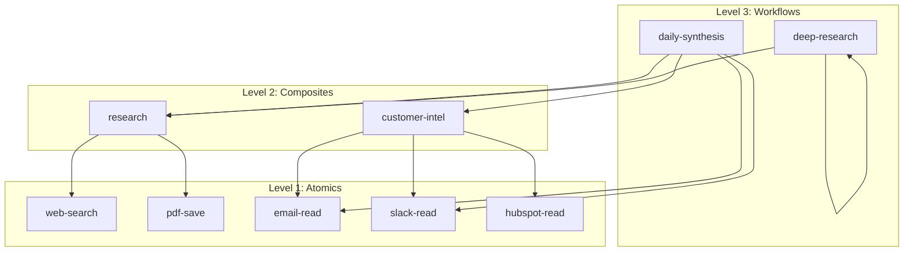

# Composable Skills Architecture with Static Type Checking

> **"Compiling Higher Order Functional Programs to Composable Digital Hardware"** → **"Compiling Natural Language Queries to Composable Agent Skills"**

This PR introduces a **composability extension** to the Agent Skills format, enabling atomic skills to be combined into higher-order workflows with static type checking—applying the same principles that made functional programming viable for hardware synthesis to LLM agent orchestration.

## The Problem: Non-Deterministic Tool Selection

As organisations develop MCP servers and agent skills, overlapping functionality creates **non-deterministic tool selection**:

| Problem | Consequence |
|---------|-------------|
| Overlapping skills | Multiple skills handle the same request differently |
| Non-deterministic selection | LLMs choose different tools for identical prompts |
| Context window bloat | Accumulated history degrades reasoning quality |
| Scope creep | Models expand tasks beyond requirements |

**The result:** Agent systems that appear to "have a mind of their own"—unsuitable for production.

## The Solution: Composable Skills with Type Checking

### Hierarchical Architecture

```
Level 3: Workflows        Complex orchestration (loops, recursion, dynamic dispatch)
    ↑ composes
Level 2: Composites       Combined operations for common patterns
    ↑ composes
Level 1: Atomics          Single-purpose operations (READ or WRITE)
    ↑ wraps
Level 0: Primitives       Raw scripts, APIs, or tools
```

### Static Type System

Skills declare typed inputs/outputs with **epistemic requirements**:

```yaml
name: research
level: 2
operation: READ
composes:
  - web-search
  - pdf-save
inputs:
  - name: query
    type: string
    required: true
outputs:
  - name: answer
    type: string
    requires_source: true      # Must cite sources
    requires_rationale: true   # Must explain reasoning
  - name: confidence
    type: number
    range: [0, 1]
```

### Composition Graph



## The FP-to-Hardware Parallel

This architecture is directly inspired by research on compiling functional programs to parallel hardware ([FCCM 2014](https://doi.org/10.1109/FCCM.2014.69)):

| FP → Hardware (Verity) | Composable Skills → LLM Execution |
|------------------------|-----------------------------------|
| Higher-order functions as parameters | L3 workflows compose L2/L1 skills |
| **Latency-insensitive interfaces** | **Typed inputs/outputs** enable composition |
| **Robust type-checking** ensures no race conditions | **`skills-ref typecheck`** ensures composition validity |
| **Composable RTL modules** | **Skills with typed schemas** |
| Distributed memories, isolated state | **Sub-agents with isolated context** |
| Single source → multiple hardware targets | Single skill → multiple execution backends |

### Why This Works

The key insight from hardware synthesis: **type-checking enables safe parallelism**. For LLMs:

| Hardware Problem | LLM Equivalent | Solution |
|------------------|----------------|----------|
| Race conditions | Conflicting outputs | Typed outputs declare what each skill produces |
| Timing violations | Context overflow | Sub-agents get isolated context |
| Undefined behaviour | Hallucination | `requires_source` enforces citations |

### On-Demand Solver Synthesis

The LLM becomes a **"compiler"** that:
1. Parses natural language specification
2. Synthesises a typed skill composition
3. Type-checks the composition statically
4. Spawns focused sub-agents in parallel
5. Aggregates results according to composition graph

Each sub-agent sees **only its typed inputs**—no conversation history, no accumulated context, no scope creep.

## Features Implemented

### New Frontmatter Fields

| Field | Type | Description |
|-------|------|-------------|
| `level` | 1-3 | Composition hierarchy tier |
| `operation` | READ/WRITE/TRANSFORM | Safety classification |
| `composes` | string[] | Skill dependencies |
| `inputs` | FieldSchema[] | Typed input parameters |
| `outputs` | FieldSchema[] | Typed output values |

### Field Schema Properties

```yaml
inputs:
  - name: query
    type: string           # Primitive or custom type
    required: true         # Required by default
    description: "..."     # Documentation
    default: "..."         # Default value

outputs:
  - name: answer
    type: string
    requires_source: true  # Epistemic: must cite sources
    requires_rationale: true  # Epistemic: must explain
    min_length: 100        # Minimum explanation length
  - name: sources
    type: string[]
    min_items: 2           # At least 2 sources
  - name: confidence
    type: number
    range: [0, 1]          # Constrained range
```

### CLI Commands

```bash
# Validate skill structure
skills-ref validate ./skills/research

# Visualize composition graph
skills-ref graph --format=mermaid ./skills

# Type-check compositions
skills-ref typecheck ./skills
skills-ref typecheck -v ./skills/_workflows
```

### Type Compatibility

| Output Type | Compatible Inputs |
|-------------|-------------------|
| `integer` | `integer`, `number`, `any` |
| `datetime` | `datetime`, `date`, `any` |
| `T[]` | `T[]`, `any[]`, `any` |

## Showcase: Trip Optimizer

A complete example demonstrating all features:

- **12 skills** across 3 levels
- **Self-recursion** (trip-optimize, option-explore)
- **L3 → L3 composition** (trip-optimize calls option-explore)
- **Typed inputs/outputs** with constraints
- **Microeconomic optimization** (expected value, Pareto frontier)

```
skills/_showcase/trip-optimizer/
├── _workflows/
│   ├── trip-optimize/SKILL.md    # L3: Main optimizer with recursion
│   └── option-explore/SKILL.md   # L3: Recursive option evaluation
├── _composite/
│   ├── destination-evaluate/     # L2: Score destinations
│   ├── route-price/              # L2: Price routes
│   └── feasibility-check/        # L2: Check constraints
└── _atomic/
    ├── flight-search/            # L1: Search flights
    ├── hotel-search/             # L1: Search hotels
    ├── weather-fetch/            # L1: Get weather
    ├── visa-check/               # L1: Check visa requirements
    ├── activity-search/          # L1: Find activities
    └── calendar-read/            # L1: Read calendar
```

## Files Changed

### Core Implementation
- `skills-ref/src/skills_ref/models.py` - FieldSchema, TypeDefinition dataclasses
- `skills-ref/src/skills_ref/parser.py` - Parse inputs/outputs from YAML
- `skills-ref/src/skills_ref/validator.py` - Type checking validation
- `skills-ref/src/skills_ref/cli.py` - `typecheck` command

### Documentation
- `docs/architecture.mdx` - Complete architecture documentation with type system

### Examples
- `examples/_showcase/trip-optimizer/` - Full showcase (12 skills)
- `examples/_workflows/deep-research/` - Recursive research example

### Tests
- `skills-ref/tests/test_validator.py` - 17 new tests for type checking

## Test Results

```
============================= 103 passed in 0.50s ==============================
```

## Backwards Compatibility

All new fields are optional. Existing skills work unchanged:

```yaml
# This still works perfectly
name: my-skill
description: A simple skill
```

## References

- [Compiling Higher Order Functional Programs to Composable Digital Hardware](https://doi.org/10.1109/FCCM.2014.69) - FCCM 2014
- [Agent Skills Specification](specification.mdx) - Base format
- [MCP Protocol](https://modelcontextprotocol.io) - Model Context Protocol

---

*This architecture extension is backwards-compatible with Agent Skills v1.0*
