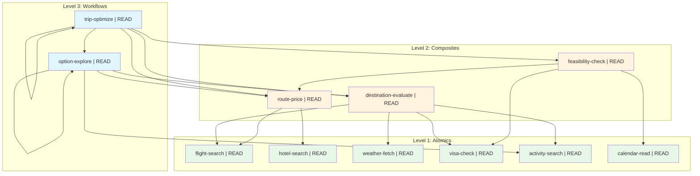

# Trip Optimizer Showcase

A comprehensive example demonstrating the full power of composable skills architecture. This trip planning optimizer showcases every major feature: fan-out parallelization, expected value optimization, gradient descent refinement, self-recursion, L3→L3 composition, and game-theoretic compute efficiency.

## The Problem

```
User: "Plan a beach or ski vacation from San Francisco, budget $2,000,
       available March 15-22 or April 5-12, good food,
       < 8hr flight or 5hr drive"
```

This requires:
- **Multi-dimensional optimization** (cost, quality, convenience, weather)
- **Constraint satisfaction** (budget, dates, visa, flight duration)
- **Parallel research** (evaluate many destinations simultaneously)
- **Iterative refinement** (gradient descent on best options)
- **Compute efficiency** (don't waste API calls on low-potential options)

## Skill Hierarchy

```
Level 3: Workflows (Orchestration)
├── trip-optimize          # Main optimizer with recursion + early termination
└── option-explore         # Deep exploration with L3→L3 composition

Level 2: Composites (Combined Operations)
├── destination-evaluate   # Multi-dimensional scoring
├── route-price            # Total cost calculation
└── feasibility-check      # Binary constraint filtering

Level 1: Atomics (Single Operations)
├── flight-search          # Search flight APIs
├── hotel-search           # Search hotel APIs
├── weather-fetch          # Historical weather data
├── visa-check             # Visa requirements
├── activity-search        # Things to do
└── calendar-read          # User availability
```

## Composition Graph



## Features Demonstrated

| Feature | Where It's Used |
|---------|----------------|
| **Fan-out parallelization** | Phase 1: Evaluate 12 destinations simultaneously |
| **Binary constraint filtering** | Phase 2: Eliminate infeasible options early |
| **Expected value ranking** | Phase 3: Prioritize high-potential options |
| **Self-recursion** | Phase 5: `trip-optimize` recurses for gradient descent |
| **L3 → L3 composition** | Phase 4: `trip-optimize` calls `option-explore` |
| **Early termination** | Phase 4: Stop when marginal return < marginal cost |
| **MECE compliance** | Clear level separation, no overlapping skills |

## Microeconomic Concepts

| Concept | Application |
|---------|-------------|
| **Expected Value** | Rank destinations by E[V] = P(outcome) × Value |
| **Marginal Cost** | Cost of one more API call |
| **Marginal Return** | Expected improvement from more exploration |
| **Opportunity Cost** | Value of unexplored alternatives |
| **Gradient Descent** | Local refinement around best option |
| **Pareto Frontier** | Present non-dominated options |

## Running the Example

```bash
# Validate all skills in the showcase
skills-ref validate examples/_showcase/trip-optimizer/

# Visualize the composition graph
skills-ref graph examples/_showcase/trip-optimizer/ --format mermaid
```

## Directory Structure

```
trip-optimizer/
├── README.md                           # This file
├── _atomic/                            # Level 1 skills
│   ├── flight-search/SKILL.md
│   ├── hotel-search/SKILL.md
│   ├── weather-fetch/SKILL.md
│   ├── visa-check/SKILL.md
│   ├── activity-search/SKILL.md
│   └── calendar-read/SKILL.md
├── _composite/                         # Level 2 skills
│   ├── destination-evaluate/SKILL.md
│   ├── route-price/SKILL.md
│   └── feasibility-check/SKILL.md
└── _workflows/                         # Level 3 skills
    ├── trip-optimize/SKILL.md          # Main entry point
    └── option-explore/SKILL.md
```

## Why This Matters

This showcase demonstrates that composable skills can express sophisticated optimization algorithms that would otherwise require custom code. The key insight is that **composition provides the control flow** - fan-out for parallelization, recursion for iteration, levels for abstraction.

Instead of writing a trip planning application from scratch, you declare the skills and their composition. The agent runtime handles execution, and the skill definitions remain auditable, testable, and reusable.
